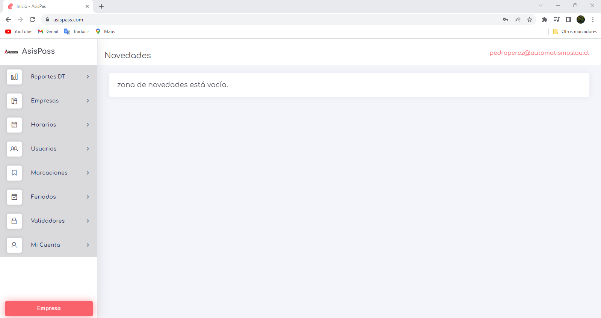
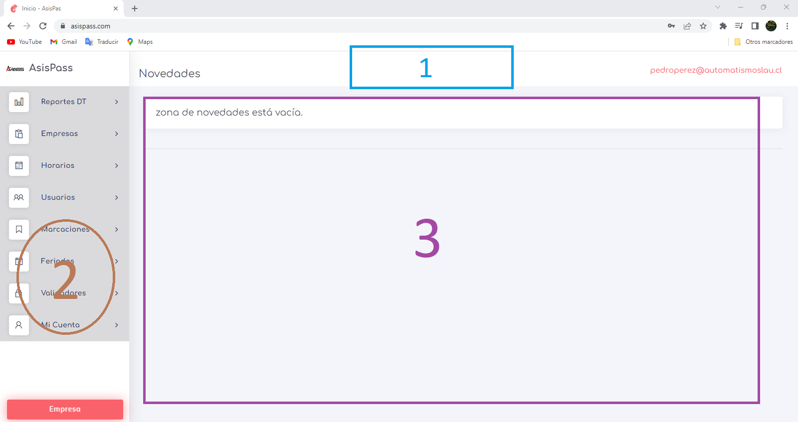

## Layout del Sistema

El layout del sistema se divide en tres partes principales: la cabecera, el panel de control y la página activa. A continuación se describe cada una de ellas:

1. **Cabecera:** Esta sección siempre muestra dos elementos: el correo electrónico de la persona que ha iniciado sesión en el sistema y el nombre de la página actual.

2. **Panel de Control:** Este elemento se utiliza para navegar a las diferentes áreas de nuestra aplicación.

3. **Página Activa:** Es la zona donde se muestra la página actual en la que nos encontramos. También se puede considerar como nuestro espacio de trabajo.

 

 [volver](./0.TodosLosUsuarios.md)