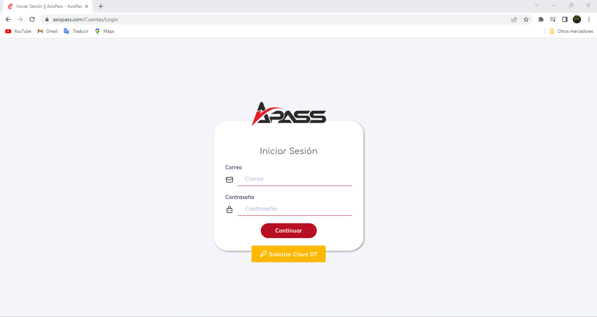
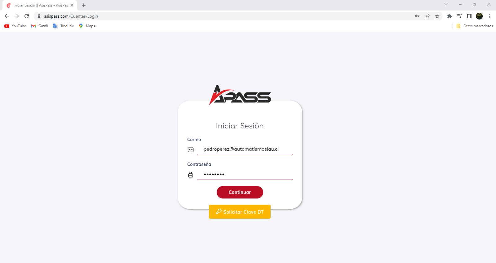
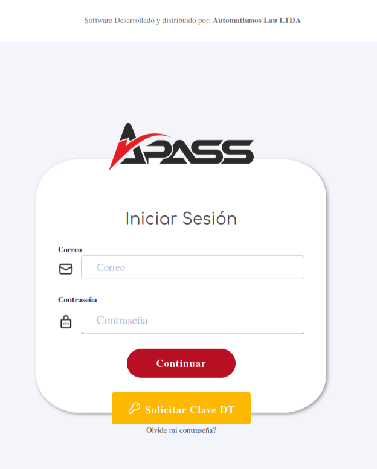
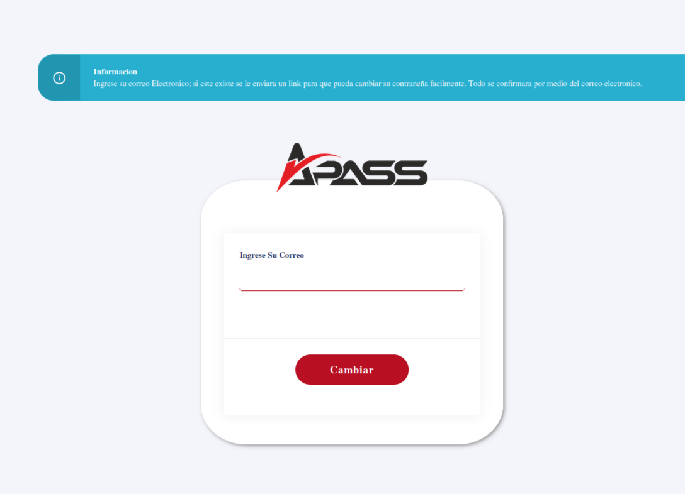

 ## Login
 
Para acceder al sistema, debes ingresar al sitio web de [Asispass](https://asispass.com). Una vez en el sitio, aparecerá una pantalla similar a la siguiente imagen:

 
 

 Para ingresar al sistema, debes introducir tu correo electrónico y contraseña. Una vez que se confirmen tus credenciales, el sistema te permitirá el acceso.

 

el boton _Solicitar Clave DT_ es de uso exclusivo para la Direccion del trabajo.

En caso de olvidar la clave; existe la opcion de __olvide mi contrasena?__ la cual se activa al dar click. Para identificarla, se encuenta en la parte inferior del login como se detalla en la siguiente imagen

Una ves se ingresa aca; se introduce nuestro correo y le indicamos "Cambiar". Desde aca nos llegaran las instrucciones para el cambio. Se puede detallar la pantalla que nos aparecerá en la siguiente imagen:

 ---

 [volver](./0.TodosLosUsuarios.md)
