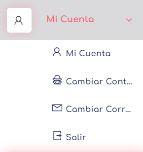
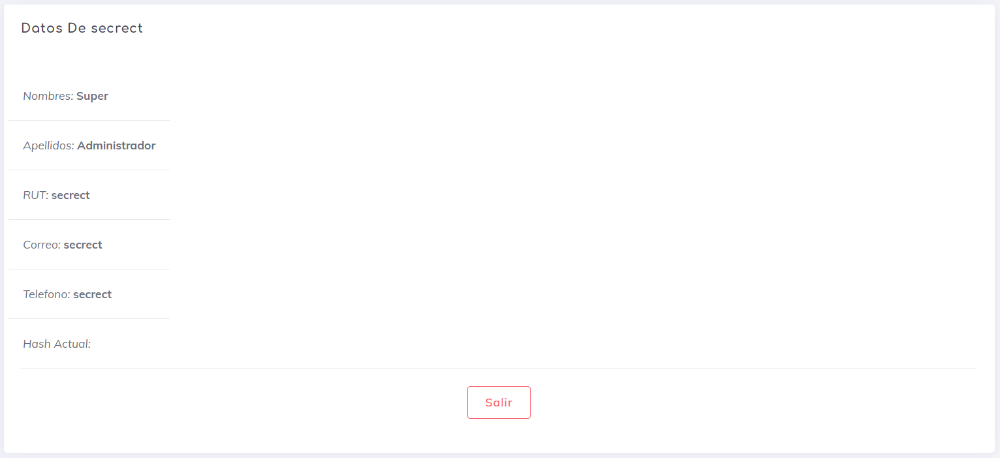
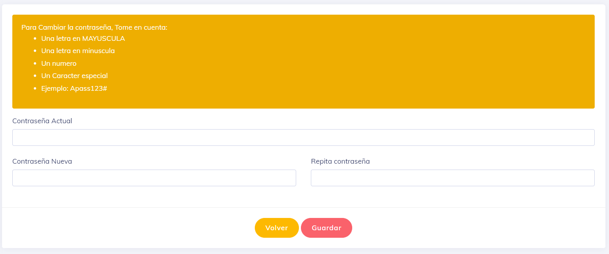

 ## Mi Cuenta
        
En esta sección encontrarás todas las opciones correspondientes a tu cuenta personal.
        
 
 
 ### Mi Cuenta

Aquí se muestran los datos personales del usuario que ha iniciado sesión en el sistema. Además, se proporciona la opción de cerrar sesión mediante el botón "Salir".

 
 
 ### Cambio Contraseña

En este apartado, puedes cambiar tu contraseña ingresando tu contraseña actual y dos veces la nueva contraseña. La página mostrará todas las restricciones correspondientes al cambio.

 
 
Una vez que se realice el cambio de contraseña, recibirás un correo electrónico que confirma el cambio y proporciona las nuevas credenciales de acceso.

 ### Cambio Correo Elecronico
 
En este apartado, puedes cambiar tu dirección de correo electrónico actual. Con este cambio, se generarán nuevas credenciales de acceso.

 [volver](./0.TodosLosUsuarios.md)
 