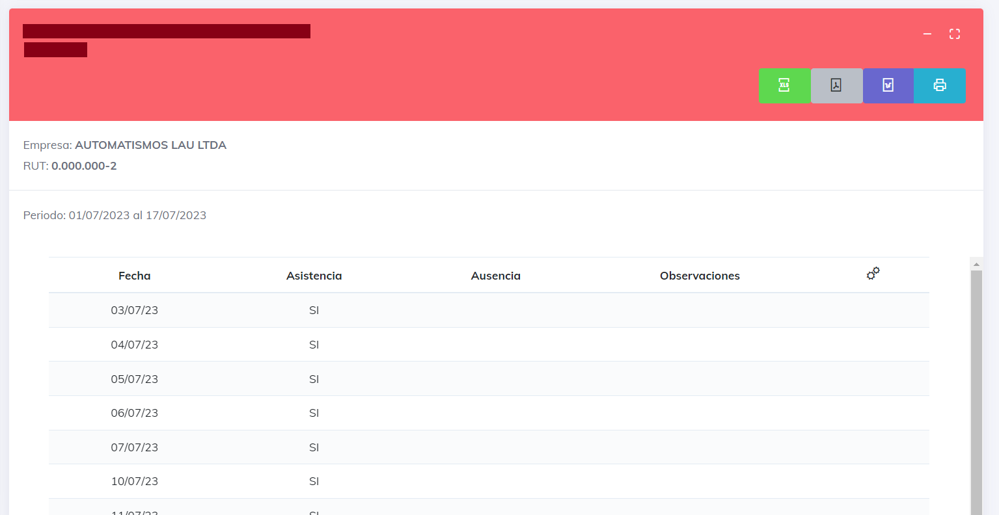

# Reporte Asistencia

El Reporte de Asistencia está diseñado de acuerdo con la normativa establecida. El propósito de este informe es indicar si un empleado ha participado en la jornada laboral de un día determinado, y en caso de ausencia, si está justificada o no.

lo primero que podemos encontrar al ingresar es el glosarion de abreviaturas, este indica de manera corta los posibles sucesos que podemos encontrar en la generacion del sistema.

También se encuentran los botones de descargas generales, que permiten exportar todos los reportes generados en un archivo descargable.

A continuación, se presenta el reporte generado por empleado, que muestra el nombre y el RUT del empleado, la fecha de creación del informe, los botones de exportación y, por último, los botones de acción.

Los botones de exportación permiten obtener el informe actual en un archivo exportable.

Los botones de acción constan de dos: uno que permite expandir o minimizar el informe actual, y otro que permite ver el informe en pantalla completa.

una ves expandido el reporte podemos observar que aparece informacion de la empresa a la que pertenece el empleado, el periodo de estudio y una tabla que nos entrega la informacion dia a dia. esta tabla tiene diferentes elementos que iremos desglosando acontinuacion:

* __fecha:__ indica la fecha del dia de estudio.
* __Asistencia:__ indicando _SI_ asistio o si _NO_ asistio a laborar este dia.
* __Ausencio:__ si la ausencia es justificada o no.
* __Observaciones:__ Algun tipo de informacion extra que se quiera agregar al dia en cuestion.

[Volver](./Reportes.MD)

