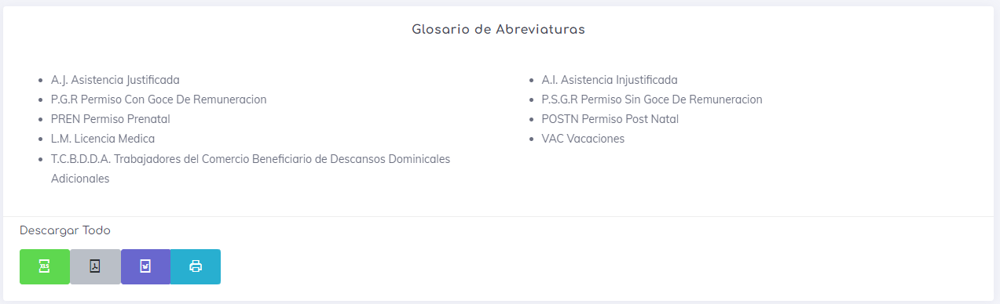
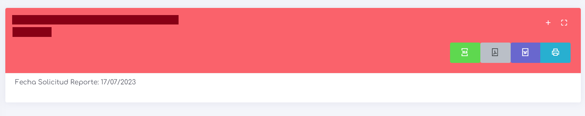

# Reporte de Domingos y Dias festivos

Este reporte está diseñado exclusivamente para los trabajadores que deben laborar los días domingos o que tienen la condición T.C.B.D.D.A. (Trabajadores del Comercio Beneficiario de Descansos Dominicales Adicionales). De esta manera, el informe muestra únicamente los días domingos y los días festivos. Además, también se puede utilizar para obtener información de aquellos trabajadores que, aunque no tengan asignados estos días en su horario, siempre y cuando estos dias se laboren.

lo primero que podemos encontrar al ingresar es el glosarion de abreviaturas, este indica de manera corta los posibles sucesos que podemos encontrar en la generacion del sistema.

También se encuentran los botones de descargas generales, que permiten exportar todos los reportes generados en un archivo descargable.

A continuación, se presenta el reporte generado por empleado, que muestra el nombre y el RUT del empleado, la fecha de creación del informe, los botones de exportación y, por último, los botones de acción.

Los botones de exportación permiten obtener el informe actual en un archivo exportable.

Los botones de acción constan de dos: uno que permite expandir o minimizar el informe actual, y otro que permite ver el informe en pantalla completa.

por ultimo encontramos una tabla con las siguientes columnas:

* **Fecha:** indicando el dia esacto de estudio.
* **Asistio:** indicando _SI_ asistio o _NO_ a esta jornada laboral.
* **TCBDDA:** Inidicando _SI_ pertenece o _NO_ a esta condicion.
* **Ausencia:** Indica _SI_ la ausencia es valida o _NO_.
* **Observaciones:** Indica alguna observacion o momento clave a resaltar con respecto a este dia.

[Volver](./Reportes.MD)