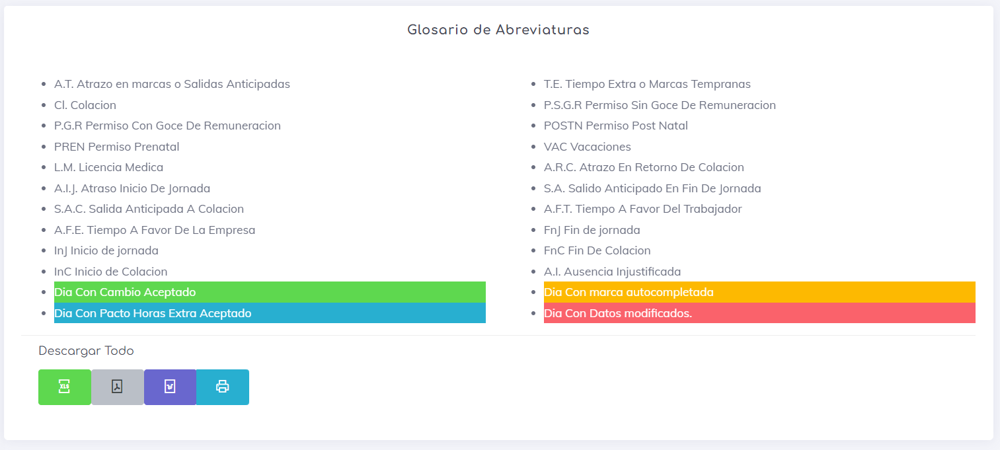
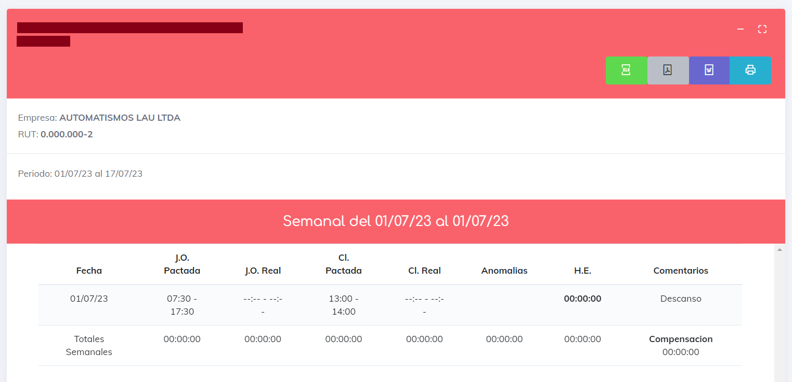

# Reporte Jornada Diaria

Este reporte proporciona un análisis exhaustivo de las marcas diarias, brindando un resumen detallado de cada marca en un día laboral. Conforme a la normativa, se combinaron y simplificaron dos informes para obtener una presentación más compacta y minimalista de la información.

Al ingresar al reporte, lo primero que encontrarás es un glosario de abreviaturas que proporciona una explicación concisa de los posibles sucesos que puedes encontrar en la generación del informe. Es importante destacar que en este informe, las abreviaturas se utilizan con mayor frecuencia debido a la gran cantidad de información que se genera por cada marca.

También se encuentran los botones de descargas generales, que permiten exportar todos los reportes generados en un archivo descargable.

A continuación, se presenta el reporte generado por empleado, que muestra el nombre y el RUT del empleado, la fecha de creación del informe, los botones de exportación y, por último, los botones de acción.

Los botones de exportación permiten obtener el informe actual en un archivo exportable.

Los botones de acción constan de dos: uno que permite expandir o minimizar el informe actual, y otro que permite ver el informe en pantalla completa.

Una vez expandido el reporte, se puede observar información de la empresa a la que pertenece el empleado, el periodo de estudio y una tabla que proporciona información detallada día a día. Esta tabla contiene diferentes elementos que se describen a continuación:

* **Fecha:** Día de estudio.
* **J.O. Pactada:** Hora de inicio y fin de la jornada según el horario establecido.
* **J.O. Real:** Hora de inicio y fin de la jornada según las marcas generadas por el empleado.
* **C.L. Pactada:** Hora de inicio y fin de la colación según el horario establecido.
* **C.L. Real:** Hora de inicio y fin de la colación según las marcas generadas por el empleado.
* **Anomalías:** Tiempo que está a favor del empleador. Estos momentos incluyen situaciones como "atraso al inicio de la jornada (A.I.J.)", donde el empleado incumplió con el horario y se suma ese tiempo como deuda hacia la empresa. Cada anomalía se detalla en esta columna.
* **H.E.** Horas extras o tiempo extra, que representa las horas adicionales laboradas en el día asignado.
* **Comentarios:** Comentarios adicionales sobre el día en cuestión.

Al finalizar la semana, se mostrarán los totales semanales en la columna de fecha correspondiente. El informe mostrará el total de la semana para cada columna:

* **J.O. Pactada:** Total de tiempo que se debió laborar.
* **J.O. Real:** Total de tiempo laborado.
* **C.L. Pactada:** Total de tiempo que se debió descansar.
* **C.L. Real:** Total de tiempo de descanso.
* **Anomalías:** Total de tiempo en anomalías.
* **H.E.** Total de tiempo extra.
* **Comentarios:** Tiempo de compensación y a quién corresponde esa compensación.

[Volver](./Reportes.MD)