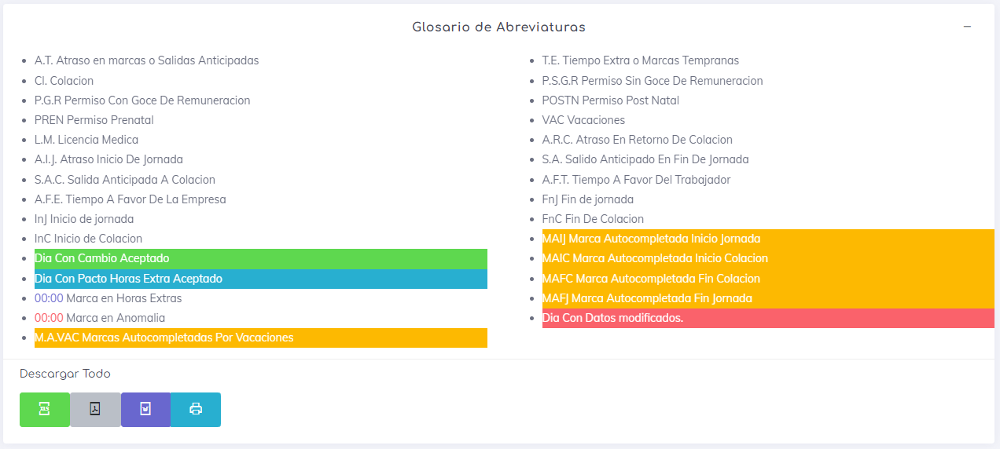
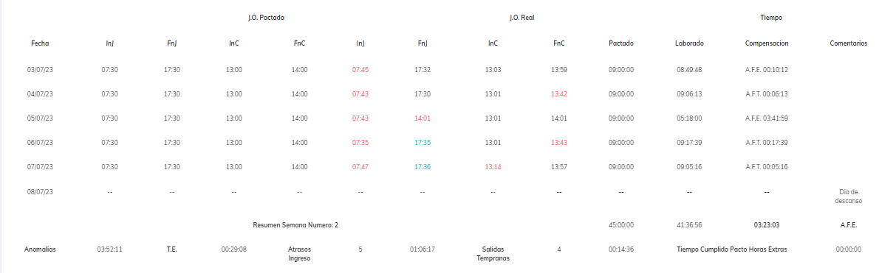
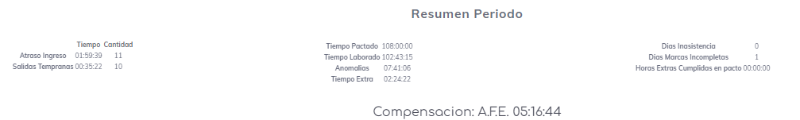

# Reporte Marcacion Mensual

Este reporte satisface las necesidades de algunos usuarios que desean obtener un informe similar a los que existían en las normativas anteriores. Se ha tratado de mantener la nomenclatura de las normativas actuales para tener la información con un resumen semanal y por periodo. Es importante aclarar que este reporte no tiene validez ante la DT (Dirección del Trabajo), ya que no ha sido revisado ni aprobado por la misma.

Al ingresar al reporte, lo primero que encontrarás es un glosario de abreviaturas que proporciona una explicación concisa de los posibles sucesos que puedes encontrar en la generación del informe. Es importante destacar que en este informe, las abreviaturas se utilizan con mayor frecuencia debido a la gran cantidad de información que se genera por cada marca.

También se encuentran los botones de descargas generales, que permiten exportar todos los reportes generados en un archivo descargable.

A continuación, se presenta el informe generado por empleado, que muestra el nombre y el RUT del empleado, la fecha de creación del informe, los botones de exportación y, por último, los botones de acción.

Los botones de exportación permiten obtener el informe actual en un archivo exportable.

Los botones de acción constan de dos: uno que permite expandir o minimizar el informe actual, y otro que permite ver el informe en pantalla completa.

Una vez ampliado, se encuentra una tabla que contiene la siguiente información:

* **Fecha:** Día de estudio.
* **J.O. Pactada:** Jornada pactada, dividida en cuatro columnas, una para cada marcación.
* **J.O. Real:** Jornada realizada por el empleado, dividida en cuatro columnas, una para cada marcación.
* **Pactada:** Indica el total en horas:minutos:segundos del tiempo pactado.
* **Laborado:** Indica el total en horas:minutos:segundos del tiempo laborado.
* **Compensación:** Indica el total en horas:minutos:segundos del tiempo de compensación y a favor de quién.
* **Comentarios:** Cualquier comentario adicional sobre la jornada actual.

Al final de cada semana, se presenta un resumen que indica los siguientes elementos:

* **Pactado:** Tiempo total pactado para la semana.
* **Laborado:** Tiempo total laborado durante la semana.
* **Compensación:** Tiempo de compensación.
* **Comentarios:** Indica a favor de quién es la compensación.

En la línea siguiente, se muestra el resumen semanal con la siguiente información:
* **Anomalías:** Tiempo en horas:minutos:segundos a favor de la empresa.
* **T.E.** Tiempo a favor del trabajador en horas:minutos:segundos.
* **Atrasos en Ingreso:** Se indica la cantidad y, en la siguiente columna, el tiempo en horas:minutos:segundos que se registraron de atrasos en el ingreso.
* **Salidas Tempranas:** Se indica la cantidad y, en la siguiente columna, el tiempo en horas:minutos:segundos de salidas tempranas.
* **Tiempo Cumplido en Pacto de Horas Extras:** El total de tiempo cumplido en un pacto de horas extras previamente generado.

Una vez finalizadas todas las semanas, se muestra al final un resumen del periodo, que indica la siguiente información:

En la primera columna, se muestran los atrasos en ingresos y las salidas tempranas.

En la segunda columna, se indican los totales pactados, laborados, anomalías y tiempos extras.

En la última línea, se muestran los días de inasistencias, los días con marcas incompletas y el total laborado en pacto de horas extras.

Al final, se puede observar el tiempo y a favor de quién sería la compensación total.

[Volver](./Reportes.MD)