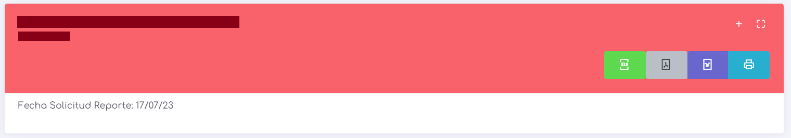
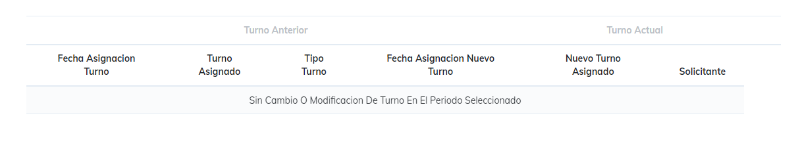

# Reporte Modificaciones y/o Alteraciones

este reporte viene a existir para indicar el listado de cambios de horario o de tipo de jornada que se le genero durante un periodo dado a un empleado especifico.

 

Se presenta el reporte generado por empleado, que muestra el nombre y el RUT del empleado, la fecha de creación del informe, los botones de exportación y, por último, los botones de acción.

Los botones de exportación permiten obtener el informe actual en un archivo exportable.

Los botones de acción constan de dos: uno que permite expandir o minimizar el informe actual, y otro que permite ver el informe en pantalla completa.

el cuerpo del reporte nos entrega una tabla, esta tabla contiene las siguientes columnas:

* **Fecha Asignacion Turno:** fecha en que se asigno el turno anterion.

* **Turno Asignado:** indicando el nombre del turno asignado anteriormente.

* **Tipo Turno:** indica si es un turno de rotacion semanal, mensual, fijo, entre otras opciones.

* **Fecha Asignacion Nuevo Turno:** fecha en que se asigno e nuevo turno.

* **Nuevo Turno Asignado:** nombre del nuevo turno asignado.

* **Solicitante:** si el cambio es por solicitud del empleado o por parte del empleador.
 
[Volver](./Reportes.MD)