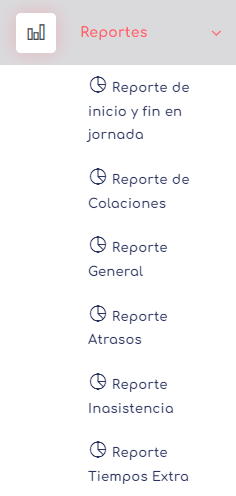

# Reportes
Actualmente nuestro sistemo consta de 10 reportes, los primeros 4 son los que se solicitan por norma para la creacion y distribucion de esto tipo de software. los siguientes reporte se han realizado por medio de solicitud de nuestros clientes para facilitar la forma de realizar diferentes calculos dentro del software. Los reportes agregados por nuestro parte son

- [Inicio y fin de jornada](./infnj.md)
- [Colaciones](./col.md)
- [Reporte General](./MM.MD)
- [Atrasos](./atrasos.MD)
- [Inasistencia](./inasistencia.MD)
- [Tiempo Extra](./te.MD)

[volver](../0.TodosLosUsuarios.md)