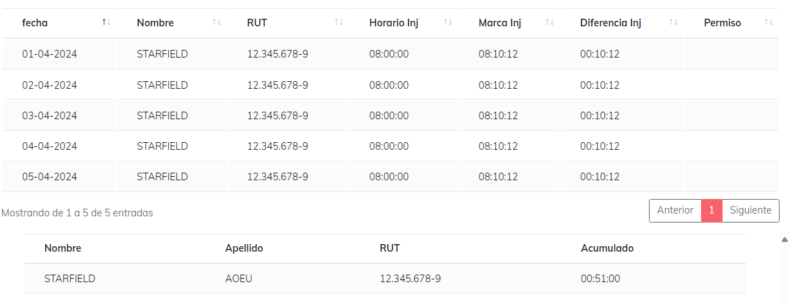

# Reporte Atrasos

Este reporte es para estudiar los atrasos en el inicio de jornada en cada dia de estudio y entregando el resumen de manero muy simplificada para hacer mas simple la busqueda y obtencion de informacion.

Para este reporte la busqueda se hace mediante el sistema de [Busqueda Simple](./SimpleSearch.MD) para genera el reporte

una ves generado el reporte podremos ver los siguiente datos.

* Fecha: dia en que se realiza el estudio
* Nombre y RUT del trabajador
* Hora segun horario del inicio de jornada
* Marca realizada en el inicio de jornada
* Diferencio a favor de la empresa en el inicio de jornada.
* en caso de existir algun permiso se muestra esta inforamion es esta area para que el usuario pueda tomar en cuenta dicha inforamcion.

luego de esto se encuentra un cuadro resument que indica los datos de cada trabajador y el total acumulado en atrasos para inicio de jornada tomados en este periodo.

