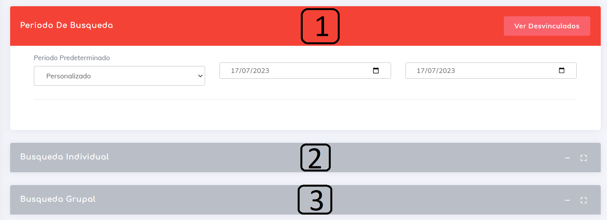
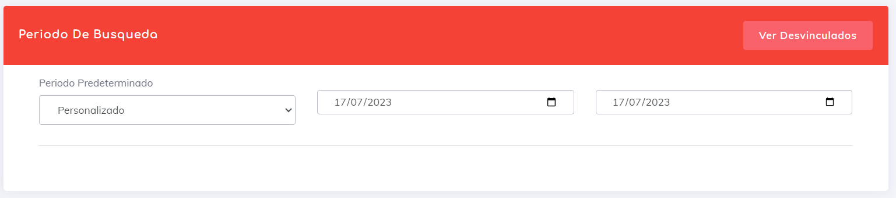
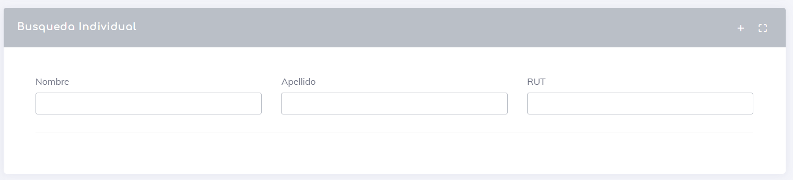
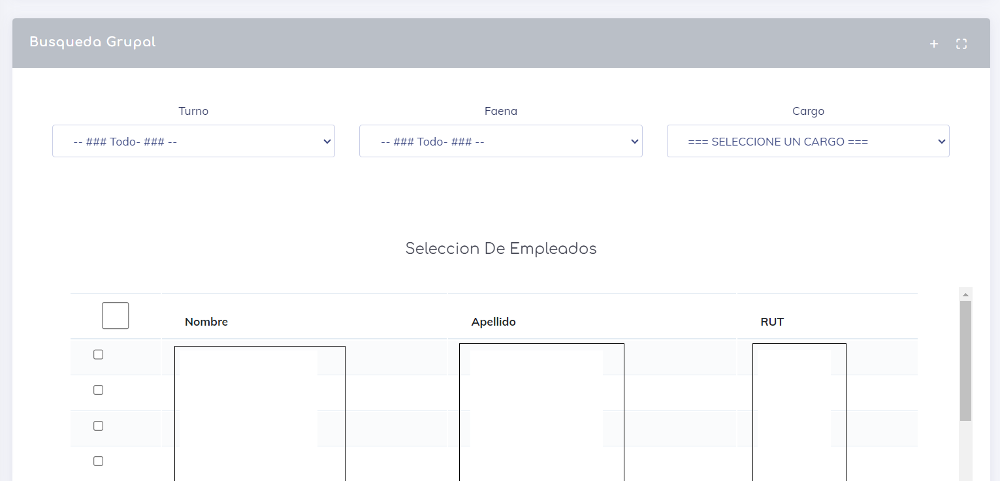

# Sistema de Búsqueda

El sistema de búsqueda de los reportes se ha desarrollado siguiendo las especificaciones de la normativa, la cual requiere su división en tres secciones principales:

1. **Periodo:** Permite seleccionar el periodo al que corresponderá el reporte.
2. **Búsqueda Individual:** Permite buscar información de un individuo en particular mediante su nombre, apellido o rut.
3. **Búsqueda Grupal:** Ofrece la opción de realizar búsquedas por grupos basándose en la información actual del sistema.

A continuación, se detallará cada una de estas secciones en mayor profundidad.

## Periodo

En esta sección se destacan 3 elementos:

* **Periodo Predeterminado**: Permite seleccionar un periodo de búsqueda predefinido, ignorando la selección de personalizadas.

* **Periodo Definido**: Esta opción consta de dos campos de entrada de fechas que permiten seleccionar un periodo específico y personalizado. La fecha del lado izquierdo indica el inicio del periodo y la del lado derecho indica el fin del mismo.

* **Botón Desvinculados/Vinculados**: Este botón define el estado de carga de usuarios/empleados en el sistema. Por defecto, carga solo los usuarios activos o vinculados. Al hacer clic en este botón, se cargan los empleados que ya no trabajan para la empresa pero que aún tienen registros en el sistema. Esta función nos parece una opción válida para separar las búsquedas y mantener la generación de reportes independientes.

Siempre se selecciona la el periodo antes de ir a cualquiera de los tipos de seleccion.

## Busqueda Individual

Esta seccion nos permite genera la busqueda de _un_ (1) individuo de manera simple, simplemente al ingresar el nombre, apellido o el rut. 

al ingresar los datos el sistema nos buscara al usuario en particular y nos generara un pequeño boton el cual al dar click sobre el nos generara el reporte esperado.

## Busqueda Grupal

En esta sección, se encuentra un área de filtrado que permite generar grupos de empleados basados en el nombre de turno/horario, la faena a la que pertenecen, el cargo que ocupan e incluso una combinación de los tres elementos al mismo tiempo.

A continuación, se encuentra la sección de selección de empleados, donde puedes ir seleccionando a los empleados para generar el reporte.

## Botón Generar Reporte

Este botón se encuentra al final del reporte y se utiliza para generar el informe grupal. A continuación, se detallan un par de reglas importantes:

* Si no se selecciona ningún empleado, se generará el informe de todos los empleados vinculados/desvinculados (según el estado) del sistema.
* Si las fechas seleccionadas no son válidas, simplemente se regresará a la pantalla inicial.

[Volver](./Reportes.MD)
