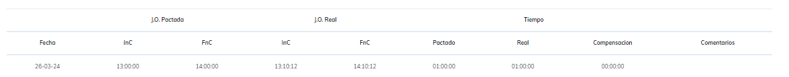
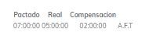

# Reporte Colaciones

este reporte ignora cualquier marca realizada que no se tome como colacion, la idea de este resument es tener un estudio dedicado al tiempo de descanso que consume el trabajador en cada jornada.

para el resumen diario podemos encontrar: 

* fecha de estudio.
* periodo de inicio y fin de colacion pactada.
* periodo de inicio y fin de colacion segun marcaciones.
* tiempo total pactado.
* tiempo total segun marcaciones.
* compensacion.
* observacion sobre lo ocurrido este dia.

para el resumen semanal y de periodo podemos encontrar
* tiempo total pactado
* tiempo total utilizado
* tiempo de compensacion y a favor de quien.

**ejemplo de semana**

**ejemplo de periodo**

[volver](./ReporteLau.MD)