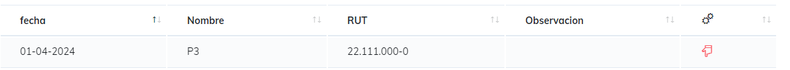
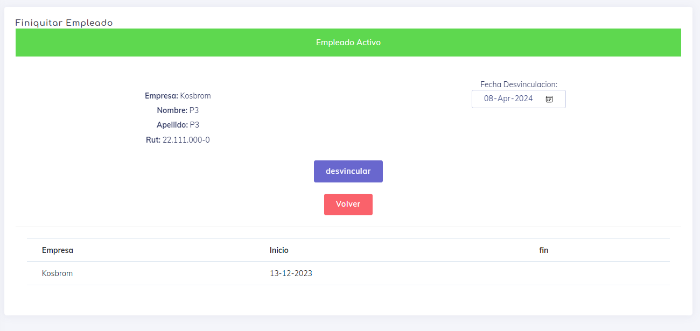

# Reporte Inasistencia

El objetivo de este reporte es indicar que dias han faltando los empleados, se puede decir que este reporte es el contrario del reporte de asistencia, con la diferencia de que aca podemos detallar esclusivamente a los usuarios que faltaron y en caso de ser necesario nos permita desvincular de la empresa a este usuario al detectar que sea algo netamente necesario.

Para este reporte la busqueda se hace mediante el sistema de [Busqueda Simple](./SimpleSearch.MD) para genera el reporte

una ves echa la busqueda, podremos observar los siguientes datos dentro del reporte:

* Fecha: es el dia en que se cometio la falta.
* Datos del empleados (nombres y RUT).
* Observacion: pueden ser permisos o vacasiones que justifiquen esta falta.
* opcion de desvincular , al precionar iremos directamente a la pantalla donde podremos desvincular a esta usuario de la empresa.

---
[Volver](./ReporteLau.MD)