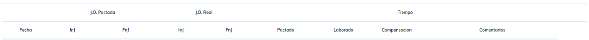
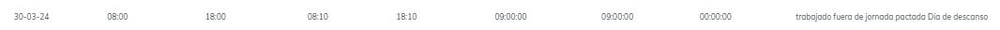
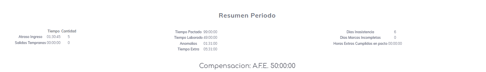

# Reporte de Inicio y fin de jornada

este reporte centra su estudio en las marcaciones echas en el inicio y fin de la jornada, ignora por completo toda la informacion de las colacion pues asume que en todos los casos dosde el empleado genero marcas en un dia tuvo una colacion perfecta.

el resument diario de este reporte nos muestra la informacion de la fecha del dia de estudio, la jornada pactada y la realizada para esta jornada tanto para las marcas como el tuempo, tambien nos entrega la compensacion basada en estas marcas y al final la informacion que pueda surgir como extra para este dia.

un _ejemplo_ sencillo puede ser el siguiente dia donde

**fecha:** 30 de marzo del 2024.
**Jornada Ordinario Pactada:** 08:00 a 18:00.
**Jornada Ordinario Cumplida:** 08:10 a 18:10.
**Tiempo Pactado:** 9 horas.
**Tiempo Cumplido:** 9 horas.
**Observacion:** indica que se laboro un dia de descanso.

 ---
al terminar cada **semana** laboral se logra mostrar un resumen del tiempo laborado de esta semana

 aca tenemos la informacion distribuida de la siguiente manera
 
 * numero de semana de estudio
 * tiempo en anomalias, es el tiempo que el empleado le debe de reponer a la empresa.
 * tiempo pactado durante el periodo
 * tiepo laborado durante el periodo
 * la compensacion y a favor de quien es dicha compensacion.

 en la sigueiente linea vemos los siguiente datos
 * Tiempo extra, el tiempo que la empresa debe de reponer al empleado.
 * cantidad y tiempo de atrasos en ingreso.
 * cantidad y tiempo de salidas tempranas

---
Luego  al final del reporte por usuario tenemos un resumen total del periodo de estudio, esta informacion se divide en 3 columnas:

**Columna 1**
indica la cantidades y tiempo de atrasos en ingreso y salidas tempranas.

**Columnas 2**
indica los tiempos de:
* Horas que se debieron de trabajar segun horario
* Horas que se laboraron segun horario
* Anomalias o tiempo que el trabajador no cumplio segun su marcaje
* Tiempo extra, o tiempo que la empresa tiene en contra por que el trabajador excedio del tiempo pactado.

**Columna 3**
este indica algunos elementos extra:
* Dias de inasistencia durante el periodo
* Dias con marcas incompletas, o dias donde se asistio a trabajar pero no se hicieron el total de marcas estipuladas en el horario.
* Horas Extra Cumpidas segun _pacto de horas extra_

Al finalizar todo se puede encontrar un resumen del tiempo pactado a reponer y a favor de quien...

[Volver](./ReporteLau.MD)