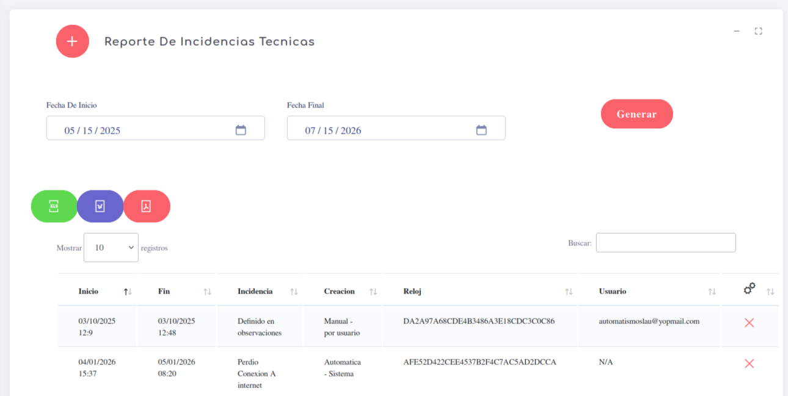

# Reporte Incidencia Tecnicas

Este reporte es para verificar si existen problemas con nuestro reloj, marcadores, huelleros o cualquiera sea el dispositivo que usemos para generar las marcas on-site. 

El reporte puede ser llenado de manera automatica cuando existen incidencias de manera directa o por perdida de conexion web o ciertos detalles que salen de nuestro control; pero tambien existe el modo de agregar datos en caso de ser necesario.

el reporte se ve de la siguiente manera:

en este reporte podemos detallar:

- **inicio** indica el inicio o el momento en que se genero la incidencia
- **Fin** momento en que se cerro o completo la incidencia
- **Incidencia** descripcion simple del error ocurrido
- **Creacion** Quien creo o genero la incidencia
- **Reloj** identificador unico del reloj donde ocurrio la incidencia
- **Usuario** Quien genero la incidencia, en caso de ser el mismo sistema no se indica nada.

