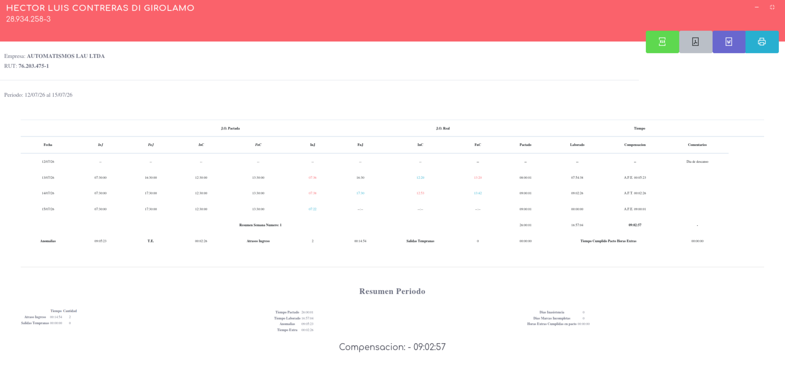

# Reporte General

Este reporte es una copa fiel de los reportes antiguos y abandonados por la Direccion de trabajo, segun la DT este reporte se abandono por que contiene mucha informacion que realmente no es util a la hora de realizar los calculos; en Automatismos lau se mantiene este reporte por solicitud expresa de Recursos Humanos ya que es el que usan. En este reporte lo podremos ver de la siguiente manera:

en donde podremos detallar que las opciones se dividen en 3 columnas superiores

* J.O. Pactada: Jornada ordinaria pactada
* J.O. Real: Jornada Ordinaria Real
* Tiempos: Resultado de calculos en el sistema.

Al final de cada semana se da un resumen de los datos segun se solicitan; sin completar que tambien se entrega un resumen total del periodo.

