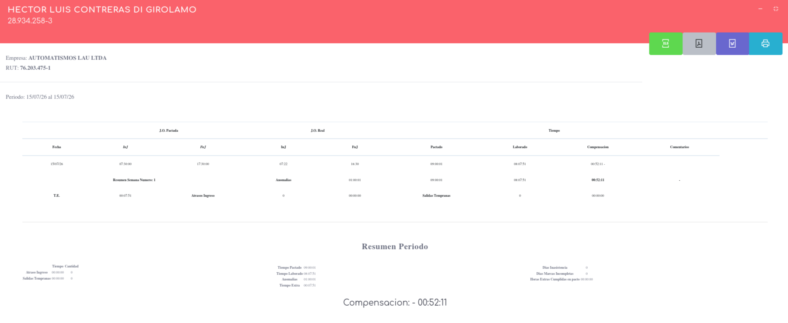

# Reporte de inicio y fin de jornada

Este reporte se centra en ensenar lo que son los calculos de la jornada ignorando por completo las marcas de colacion (por esta razon no es un reporte valido para la DT). el reporte se detalla de la siguiente manera

las columnas entregan la siguiente informacion:

- **Fecha** fecha de estudio
- **Inj** horario para el inicio de jornada
- **Fnj** horario para el fin de jornada
- **Inj** marca de inicio de jornada
- **Fnj** marca de fin de jornada
- **Pactado** tiemmpo pactado
- **Laborado** tiempo laborado segun las marcas y restando en automatico el tiempo de colacion
- **compensacion** Tiempo de compensacion propuesto por el dia
- **Comentarios** comentarios extra

