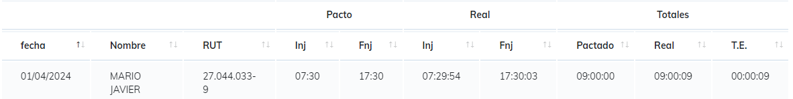

# Reporte Tiempo Extra
El enfoque de este reporte es entregar al usuario la opcion de saber que cantidad de tiempos se esta tomando cada empleado por jornada y un total del periodo.

Para este reporte la busqueda se hace mediante el sistema de [Busqueda Simple](./SimpleSearch.MD) para genera el reporte

una ves generamos nuestro reporte podemos observar que por dia obtenemos la siguiente informacion

* Fecha, dia en que ocurrio el evento
* Datos del trabajador (nombres de pila y RUT)
* Jornada pactada, solo el inicio y fin de jornada segun horario.
* Jornada Real, solo el inicio y fin de jornada segun sus marcaciones.
* tiempo total pactado para la jornada.
* Tiempo real laborado segun marcaciones.
* el total de tiempo extra, este dato solo se observa cuando existe un tiempo a favor del trabajador.

Una ves se termina el paseo por dias, se puede observar el total de tiempo extra que tiene cada trabajador en el periodo seleccionado.