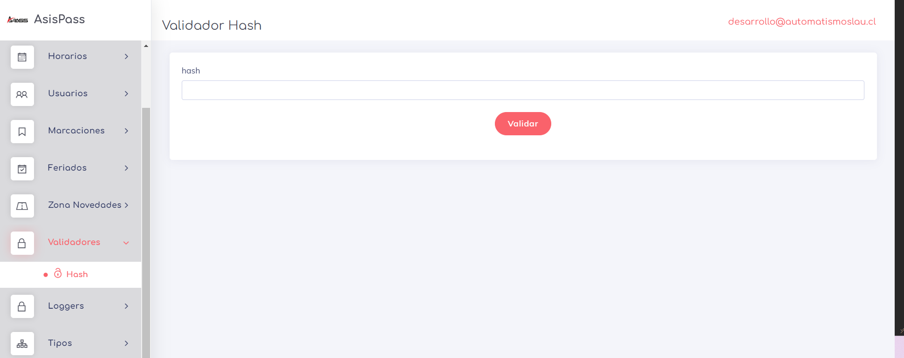
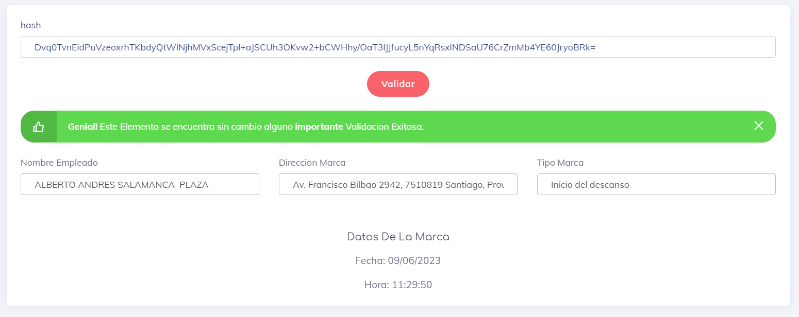

## Validadores

En esta sección encontrarás validadores que están activos en el sistema. Los validadores son funcionalidades que nos ayudan a comprobar la rigides de algun elemento dentro del sistema.

### Hash 

Este validador nos permite verificar si nuestras marcas son correctas e incluso su integridad en base de datos. Los códigos de validación de cada marca siempre están presentes tanto en el ticket de impresión como en el correo electrónico que se envía.

Para utilizar este validador, simplemente introduce el código que acompaña a las marcas en el recuadro denominado "hash". De esta manera, obtendrás información sobre el elemento que se está validando. La siguiente imagen muestra lo mencionado anteriormente:

 
 

 [volver](./0.TodosLosUsuarios.md)