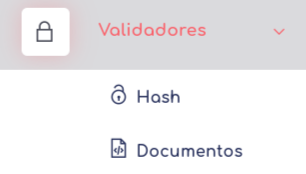
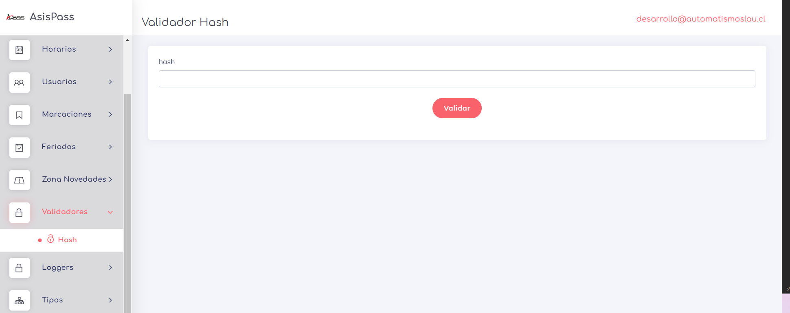
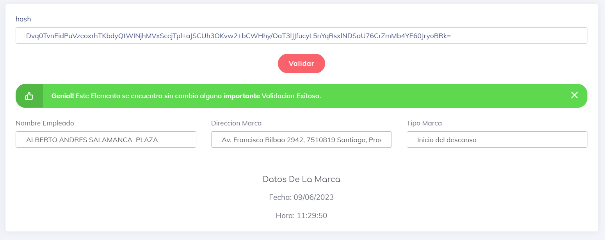
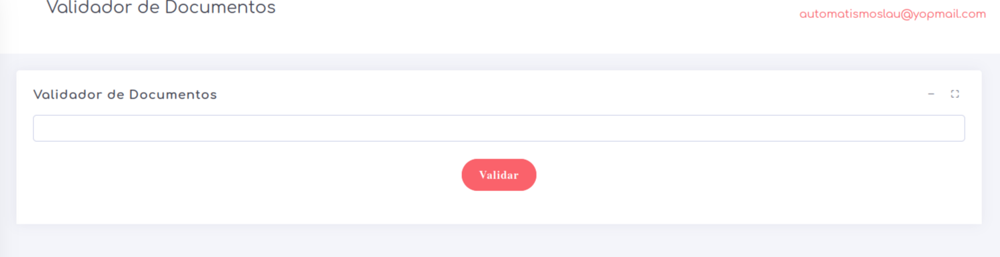
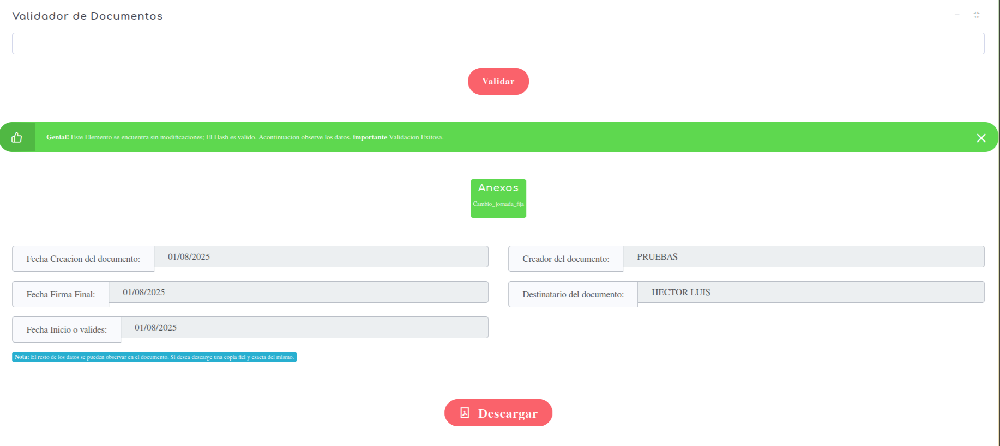

## Validadores

Estos validadores o comprobantes de hash son elementos que permiten ver la integridad de una marca o de las firmas y aceptacion de un documento. la seccion de validadores se ve similar a la siguiente opcion:

### Validador Hash 

Este validador nos permite verificar si nuestras marcas son correctas e incluso su integridad en base de datos. Los códigos de validación de cada marca siempre están presentes tanto en el ticket de impresión como en el correo electrónico que se envía.

Para utilizar este validador, simplemente introduce el código que acompaña a las marcas en el recuadro denominado "hash". De esta manera, obtendrás información sobre el elemento que se está validando. La siguiente imagen muestra lo mencionado anteriormente:

 
 

### Validador De Documentos 

Similar  al validador Hash, el validador de docummentos se muestra de manera donde se debe de introducir el hash del mismo documento en su espacio

una ves busca nos muestra la informacion de este documento y sus firmas como se detalla en la siguiente imagen

del mismo modo podremos obtener el documento desde este mismo elementos si asi lo deseamos.

Con este punto ya no es necesario usar otros software de firmado de documentos ya que el nuestro es validado directamente por la DT.

---

 [volver](./0.TodosLosUsuarios.md)
