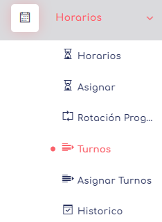

    > Glosario
    [C] Sinifica que es un atributo commun para cualquier tipo de usuario

# Administrador de Empresa

El usuario "Administrador de Empresa" es el encargado de habilitar usuarios empleadores, administrar todo lo correspondiente a las empresas y promover e indicar cómo se utiliza la aplicación en su empresa. A continuación, se presenta un listado de todas las características válidas para este usuario:

* [Login](../0.TodosLosUsuarios/Login.MD) [C]
* [Layout](../0.TodosLosUsuarios//Layout.MD) [C]
* [Reportes DT](../0.TodosLosUsuarios/./Reportes/Reportes.MD) [C]

   
* [Reportes](../0.TodosLosUsuarios/Reportes/ReporteLau.MD) [C]

* [Indicadores De Gestion](./IG/Index.md) Aca nos muestra de manera simple lo que esta ocurriendo en nuestra empresa en momentos actuales.

* [Empresas:](./Empresas/index.md) Permite gestionar y administrar la información relacionada con las empresas en el sistema.

* [Horarios:](./Horarios/index.md) Permite definir y configurar los horarios de trabajo para los empleados de la empresa.

* [Usuarios:](./Usuarios/index.md) Permite gestionar y administrar los Empleados(y grupos) de cada empresa mientras la empresa deseada se encuentre activa.

* [Marcaciones:](./Marcaciones.md) Permite realizar el registro y seguimiento de las marcas de los empleados, generar cambios en alguna marcacion, generar permisos, crear pactos de horas extras... 

 
--
* [Feriados](./Feriados.MD) [C]

* [Validadores](./Validadores.md)   [C] 

* [Mi Cuenta](./MiCuenta.md) 
    > **Nota:** este tipo de usuario tiene un extra. Este extra es [Empresa Activa](./EmpresaActiva.md)
    

--

 [volver](./../README.md)