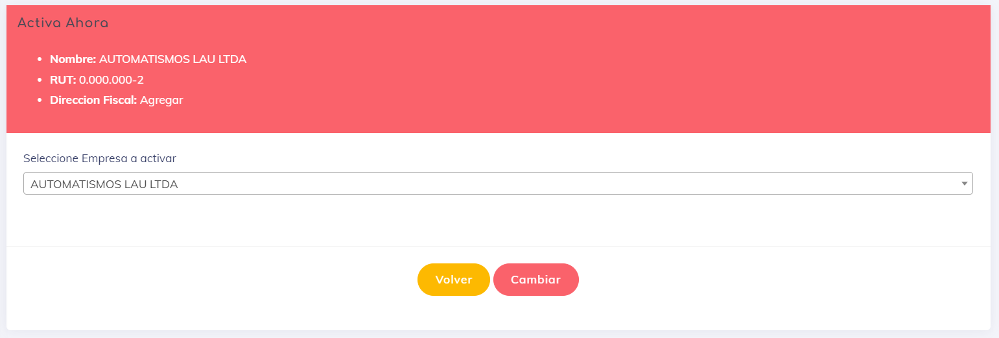

# Empresa Activa

Esta vista es de vital importancia para los usuarios que tienen varias empresas en su sistema. En Asispass, la mayoría de las vistas y funcionalidades se basan en la empresa que está activa para el usuario actual. Esta vista permite cambiar la empresa activa de manera sencilla.

El usuario tiene una lista para seleccionar la empresa que desea activar en ese momento:

Simplemente cambiando de empresa y haciendo clic en "Guardar", nuestro sistema cambia y obtiene siempre los datos de la empresa activa seleccionada.

---
[volver](./1.AdmoEmpresas.MD)