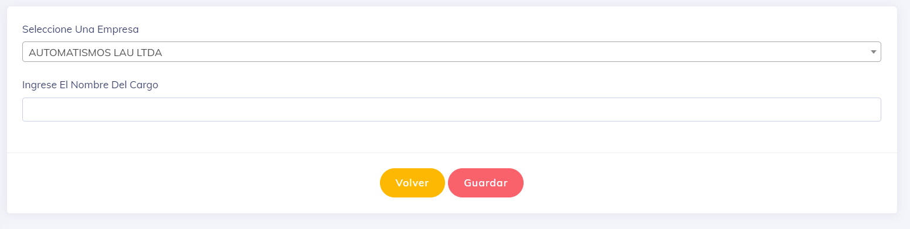

### Crear Cargo

Una vez que ingresamos al sistema, se muestra la siguiente vista:

En la primera opción, seleccionamos la empresa a la que pertenece este cargo.

En la segunda opción, ingresamos el nombre del cargo propiamente dicho.
