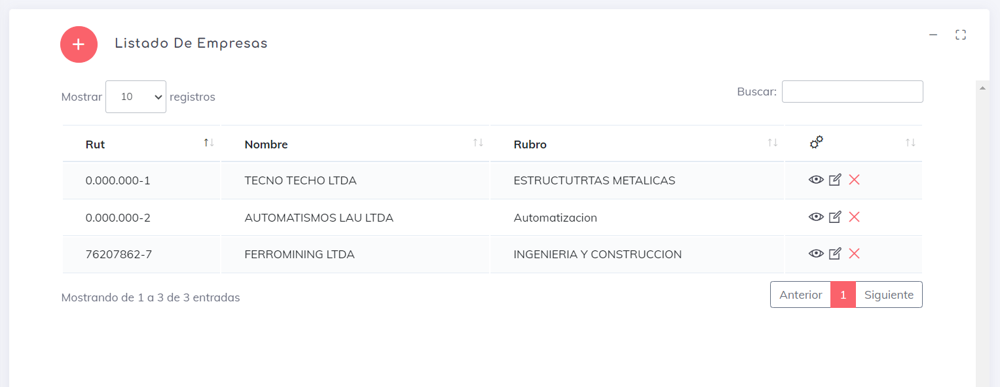

## Empresa

En este segmento, podrás observar las empresas que están inscritas en nuestro sistema, así como crear, editar, eliminar y ver los detalles de cada una de ellas.

Para [crear](./crear.md) una empresa, simplemente haz clic en el botón .

También disponemos de los siguientes botones :

* [Detalles de Empresa](./Details.md) : Permite ver los detalles de una empresa específica.
* [Editar Empresa](./edit.md) : Permite editar los detalles de una empresa existente.
* Eliminar Empresa : Con este botón se elimina una empresa y, de inmediato, todos los empleados que pertenecen a ella quedan inactivos en el sistema.

    > Recuerda que al eliminar una empresa, se desactivarán automáticamente todos los empleados asociados a ella en el sistema.

--- 

[volver](./index.md)