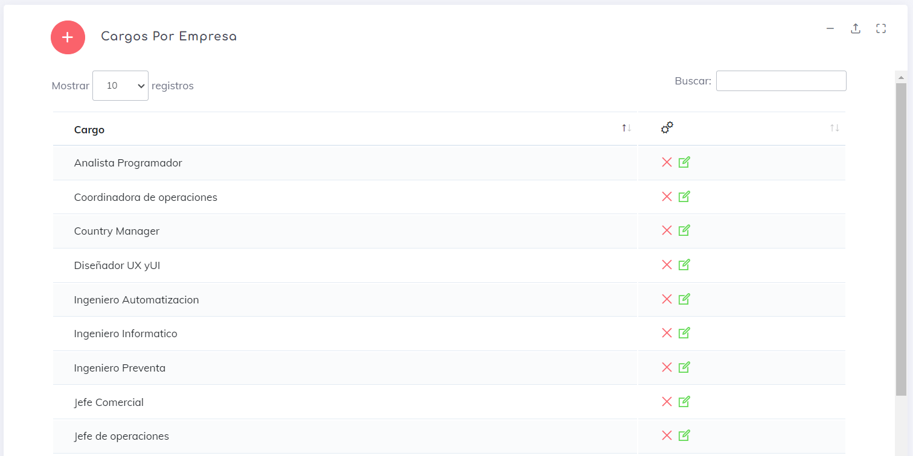

## Cargos

Esta opción es una exigencia de la DT (Dirección del Trabajo) con respecto al filtrado de empleados en los reportes por cargo. Por tanto, nos vimos en la necesidad de permitir que cada empresa pueda administrar de manera activa los cargos que aplica en su planilla.

Recomendamos crear todos los cargos antes de crear los empleados, para hacer que el flujo de creación de usuarios sea más sencillo.

Además de obtener el listado de cargos, también podemos realizar las siguientes acciones:

1. Para [crear](./CargoCrear.md) un nuevo cargo, simplemente haz clic en el botón .

2. Para eliminar un cargo, haz clic en el botón .

3. Para [editar](./CargoEdit.md) un cargo existente, busca el botón adyacente a él .

---

[Volver](./index.md)
