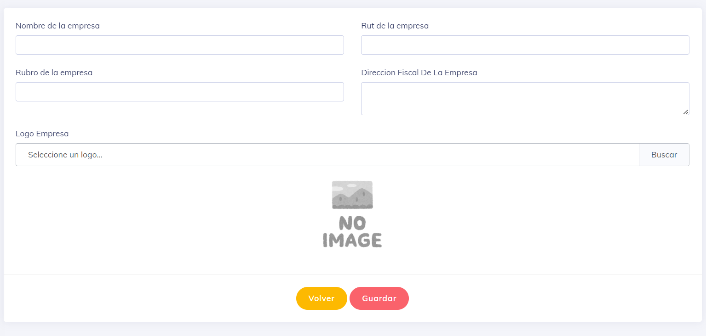

## Crear Empresa

En el título de la página, se encuentra el botón de crear, que se muestra a continuación:

Al hacer clic en este botón, se mostrará una pantalla similar a la siguiente:

En esta pantalla, se pueden llenar los datos necesarios para crear una empresa. Los siguientes campos son obligatorios, según la solicitud de la DT (Dirección del Trabajo):

* Nombre de la empresa.
* Rut de la empresa.
* Dirección fiscal de la empresa.

Estos campos deben ser completados obligatoriamente para crear una empresa en el sistema.

Los campos de rubro y logo de la empresa no son obligatorios para crear una empresa en el sistema.

--

[Volver](./Empresas.md)