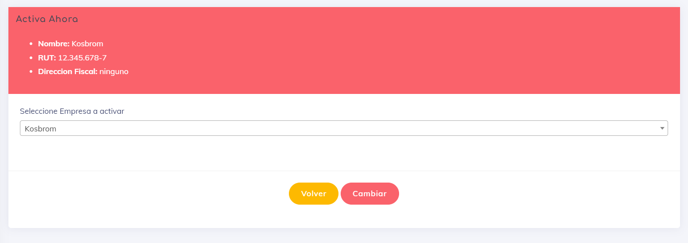

# Empresa Activa
En esta seccion podremos definir con que empresa trabajaremos en el sistema. Esta opcion siempre  esta activa pero tiene a tener sentido  para usuarios que maneja   mas de 1 empresa.

Al entrar en esta seccion generar el cambio; realmente es muy sercillo generar el cambio pues es simplemente seleccionar la otra empresa y cambiarla.

por motivos de aclarar en la parte superior de nuestra pantalla parecen algunos datos de la empresa que actualmente se encuentra activa en el sistema.
