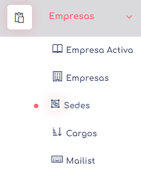

## Empresas

Permite gestionar y administrar la información relacionada con las empresas en el sistema.

este segmento se divide a su ves en varios elementos: 
* [Activa](./ea.md), Desde aca podremos definir que empresa podremos definir como la activa para trabajar en sistema. 
* [Empresas](./Empresas.md), aca se administrar las empresas correspondientes a este grupo.
* [Sedes](./sedes.md), para administrar las sedes correspondientes a la empresa activa
* [Cargos](./cargos.md), para administrar los cargos que correspondan a la empresa.
* [Mailist](./mailist.md), para el envio de emails a personal ajenas al uso del sistema.

 [volver](../1.AdmoEmpresas.MD)   