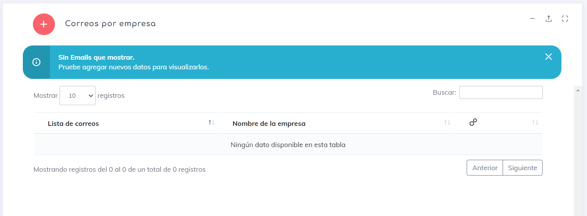
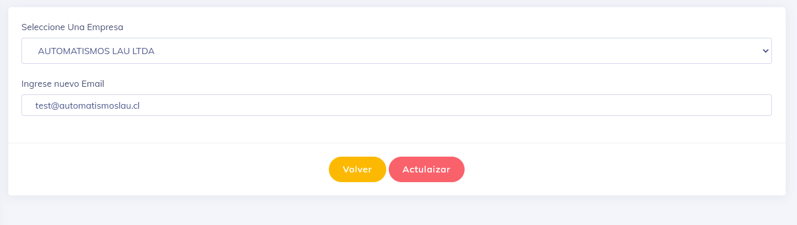

## Mailist

Esta opcion nace por la necesidad de que el sistema envie los correos de cierre diario o mensual a otras personas dentro de la empresa. 

Al entrar en este apartado podemos observar el listado de personal que tenemos agregados actualmente para enviar los listados de nuestra empresa.
 
 

1. Para agregar un nuevo correo electronico, simplemente haz clic en el botón . Acontinuacion agregamos el nuevo correo y guardamos.

2. Para eliminar un mail, haz clic en el botón .

3. Para editar un mail existente, busca el botón adyacente a él . Y ya edicion es tan sencilla como la creacion.

---
[volver](./index.md)