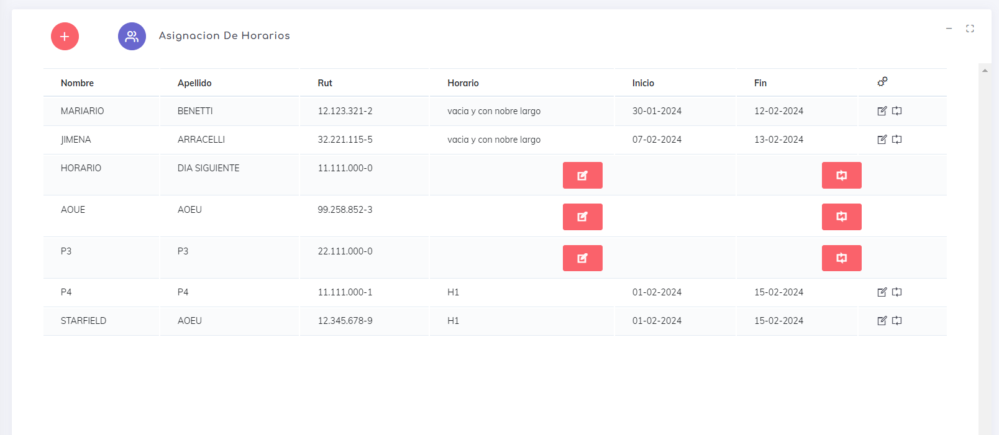
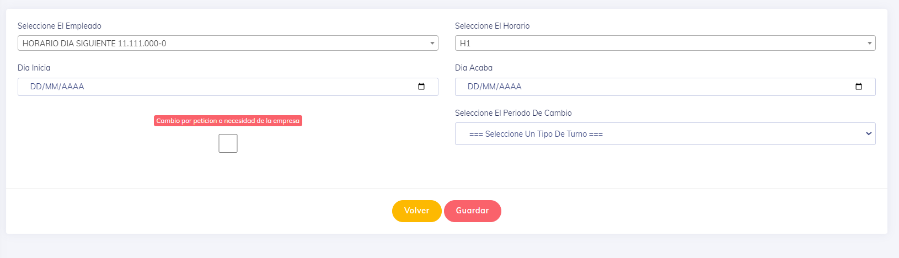

una ves ingresamos podemos ver la siguiente pantalla

la asignacion de horarios  es bastante simple, al entrar en la pantalla correspondiente, se pueden notar que se puede genegar una asignacion individual con los botores   o con 

* para asignar un horario es bastante intuitivo.. en la siguiente pantalla

    

---

[volver](./index.md)