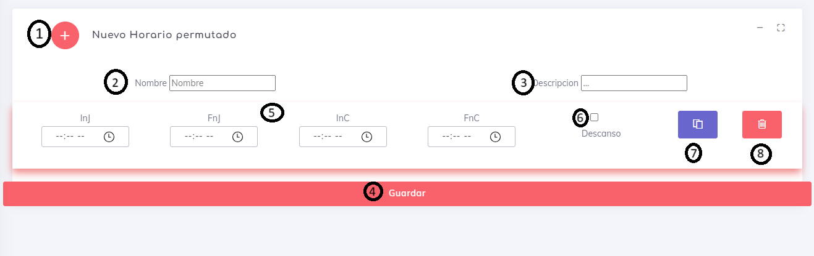
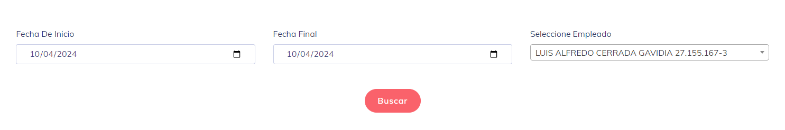
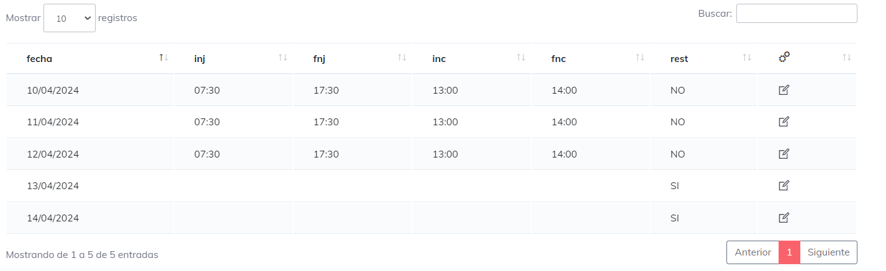
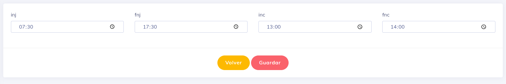

# Turnos 

Como bien se indico, este elemento se realizo para cubrir la necesidad de aquellas empresas o puestos de trabajon que salen por completo de la norma legal, con esto nos referimos a las empresas que los periodos de laburo difieren en periodos distinto a los semanales que se usan de manera convencional. El mejor ejemplo que se puede tomar aca en cuenta es la asignacion de horarios para el area minera.

## Crear un horario 

Al ingresar en esta area se puede encontrar la siguiente pantalla:

al interactuar con esta pantalla podremos generar cualquier elemento y de este modo crear un horario completamente a conveniencia. Para ser mas especifico:

1. en este apartado se agrega un nuevo dia completamente limpio para ser editado.
2. podremos agregar un nombre al horario para asi poder identificarlo con facilidad, el nombre es completamente necesario para la creacion.
3. la descripcion es completamente opcional.
4. boton mediante el cual se crea el nuevo horario. es necesario que exista al menos 1 dia y tenga un nombre para poder crear un horario.
5. periodo de trabajo recordar siempo que :
    * __inj__ = inicio de jornada
    * __fnj__ = fin de jornada
    * __inc__ = inicio de colacion
    * __fnc__ = fin de colacion
para que un dia sea valido debe de tener al menos _inc_ y _fnc_ con valores validos, si no se toma como un dia de descanso.
6. al seleccionar este checked, el sistema ignora cualquier configuracion y hace que este dia sea de descanso.
7. copia el dia actual y lo agrega al final de la lista
8. elimina el dia actual y se pierde cualquier configuracion echa.

otro elemento a destacar es que si necesitamos cambiar el orden de nuestro dias simplemente podremos arrastrar el dia a su nueva ubicacion sin problemas.

un detalle es que la asignacion de horario se hace tomando en cuenta siempre el orden donde el primer dia a asignar es que esta en la parte superior a nivel visual, y el ultima es el que se encuentra al fondo de la lista.

## Otras Opciones 

Para la opcion de eliminar  es tan simple como dar click y nuestro elemento queda automaticamente fuera del sistema.

en el caso de la edicion  es similar al crear con la diferencia de que al ingresar voy a poder obtener los datos del horario anterior.

## Editar Dias Asignados 

Esta opcion esta pensada para observar el detalle de los dias ya asignados por el sistema y con la posibilidad de modificar los dias con la condicion de que solo se pueden modificar dias futuros y el dia en curso.

Una ves se ingresa se puede observar que tenemos un buscador simple

esto buscador nos permite seleccionar un periodo y 1 usuarios para poder observar cada asignacion que ya se haya ejecutado para cada usuario en el periodo seleccionado

si clickeamos en la opcion de editar nos permite modificar las horas sin problema alguno

se realizan las modificaciones pertinentes y con dar guardar, ya tenemos nuestro dia perfectamente modificado.

---

### Notas a tomar en cuenta

* el horario se asigna por periodos de manera automatica una ves sea el momento de empezar el horario.
* el asignador solo toma como fin hasta llegar el ultimo dia de asignacion o simplemente hata que sea el ultimo dia del periodo
* modificar un horario que ya fue asignado no modifica la asignacion.
* solo se puede asignar a partir del dia actual.
* el horaio parte a ser asignado a partir del dia de inicio.
* el periodo de asignacion depende del numero de dias que tenga cada horario.

[Voler](./index.md)