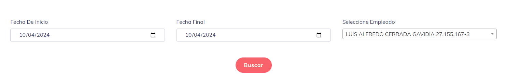
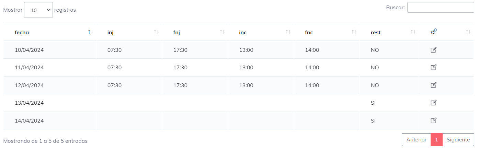

# Asignar Turno

Aca podremos encontrar al ingresar un listado de los turnos que esten asignado para algun usuario. al ingresar obtenermos una vista similar a la siguiente imagen

si nos enfocamos en el listado podremos observar que tenemos los datos del trabajador acompañado del periodo mediante el cual tiene una asignacion. Tambie podremso opservar ciertas acciones que podremos ejecutar para cada uno de estas asignaciones.

### las opciones son:

1.- **Desactivar:**  si el horario se encuentra activo con esta opcion aremos que no se asignen futuros horarios para este usuario; en otras palabras podremos dejar sin efecto esta asignacion para futuras referencias.
2.- **Activar:**  en caso de que sea un error y en pocos dias el tiempo de actividad de esta asignacion se modifique, simplemente con dar click, volvemos a activar para su uso en posteriores aplicaciones.
3.- **Editar:** con una vista similar a la de asignar a usuario/grupo nos permite editar esta asignacion de usurio

## Asignar a Trabajador/Grupo

Estas son dos de las opciones que se encuentran en el lado superior de la pagina. la diferencia muy aparte de los iconos son, que una es para asignar esclusivamente a usuarios individuales, y la otra opcion para aplicar a grupos de usuarios ya creados anteriormente.

una ves ingresemos en esta visto tendremos algo similar a la siguinente imagen:

**donde:**

1. es donde seleccionamos el trabajador a grupo de trabajadores.
2. inicio del periodo de asignacion.
3. dia final de la asignacion de horarios.
4. horarios elegibles para asignar
5. horarios elegidos, el orden de asignacion es de arriba hacia abajo, se puede hacer scroll en caso de necesita cambiar el orden.

## Editar Dias Asignados 

Esta opcion esta pensada para observar el detalle de los dias ya asignados por el sistema y con la posibilidad de modificar los dias con la condicion de que solo se pueden modificar dias futuros y el dia en curso.

Una ves se ingresa se puede observar que tenemos un buscador simple

esto buscador nos permite seleccionar un periodo y 1 usuarios para poder observar cada asignacion que ya se haya ejecutado para cada usuario en el periodo seleccionado

si clickeamos en la opcion de editar nos permite modificar las horas sin problema alguno

se realizan las modificaciones pertinentes y con dar guardar, ya tenemos nuestro dia perfectamente modificado.

---

### Nota a tomar en cuenta

* la asignacion de horarios se puede hacer tanto individual como grupal.
* una ves asignado estos horario se pueden modificar de manera individual
* para modificar los horarios solo se puede cambiar la fecha final y el orden y horarios de la asignacion.
* el sistema funciona con prediciones de periodos.
* una ves que el tiempo de fin del periodo de asignacion, por seguridad y limpieza los datos dejan de ser visibles. sin embargo se puede ver la asignacion pasada que se hiza a cada dia.

[Voler](./index.md)