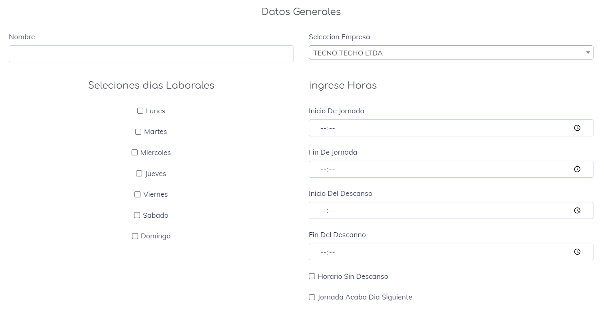
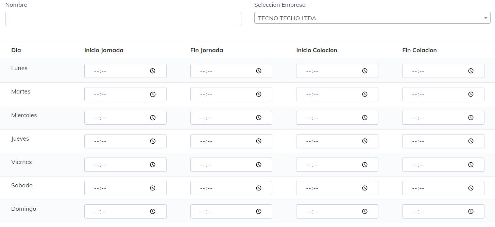

### Crear Horario

Una vez que ingresamos, nos  muestra la creacion de horarios Homogeneos, se puede apreciar en la siguiente imagen:

En esta pantalla, debemos ingresar los siguientes datos:

* __Nombre:__ Es un identificador del horario.
* __Selección de días laborales:__ Permite indicar a qué días pertenece el horario actual.
* __Selección de Empresas:__ Permite seleccionar a qué empresa pertenece este horario(Esto solo aparece si hay más de una empresa en el sistema).
* __Horas:__ Aquí se indica el inicio y fin tanto de la jornada como de la colación.

Al final, encontramos dos opciones que se pueden seleccionar:

__Horario Sin Descanso__: Esta opción es para aquellos horarios corridos en los que no se toma descanso o son jornadas cortas.

__Jornada Acaba Día Siguiente__: Esta opción es para aquellos horarios en los que el trabajo es mayormente nocturno y la fecha de inicio y fin son diferentes.

Una vez que se completan todos estos datos, el horario queda disponible para su uso en el sistema.

---

tambien existe el boton toggle Horrario que nos permite crear un horario Heterogeneo, el cual podemos observar en la siguiente imagen:

de este modo nos habriria el creador de horario heterogeneo, que seria como se muestra en la siguiente pantalla:

en el cual debemos de llenar los siguientes campos:

* __Nombre:__ Es un identificador del horario.
* __Selección de días laborales:__ Permite indicar a qué días pertenece el horario actual.
* __Selección de Empresas:__ Permite seleccionar a qué empresa pertenece este horario(Esto solo aparece si hay más de una empresa en el sistema).
* __Horas por dia:__ Aca se agregar la jornada por dia laborable; los dias que no se laboren o los espacios de jornada que no cubra nuestro interes simplemente lo dejamos en blanco.

[Volver](./Horarios.md)
