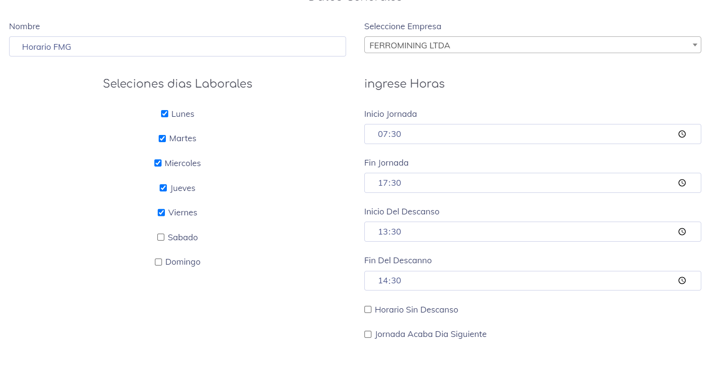

## Actualizar Horario

Al entrar a esta sección; El sistema nos muestra una vista dependiendo del tipo de horario que estemo trabajando.

En el caso de ser un horario Homogeneo obtenemos una vista similar a la siguiente imagen:

Y en el caso de ser un horario Heterogeneo obtenemos una vista similar a la siguiente imagen:

En esta vista, obtenemos el horario tal como está actualmente activo.

Aquí podemos realizar cualquier cambio que deseemos y, una vez terminado los cambios, simplemente guardamos.
