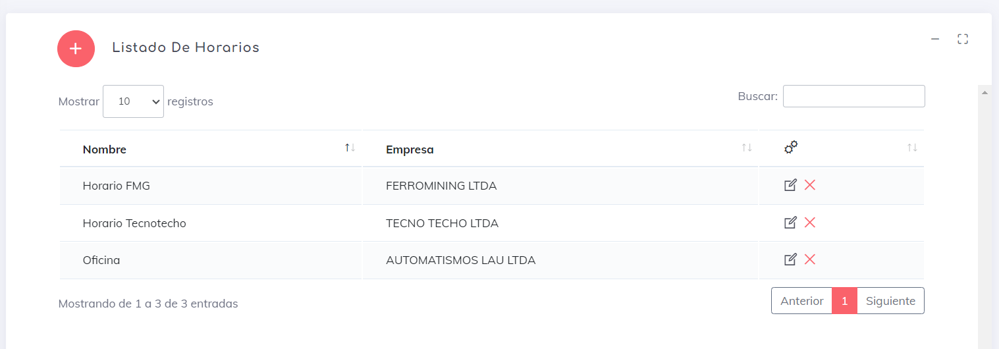

### Horarios

En esta sección de la aplicación, podremos crear, editar y eliminar horarios para el trabajo general de nuestra(s) empresa(s).

Al ingresar, lo primero que encontramos es la siguiente vista:

En esta vista, se muestra un listado de los horarios activos. Además, podemos seleccionar la cantidad máxima de elementos que se deben mostrar por página, navegar entre las diferentes páginas e incluso hacer filtros por empresa o nombre utilizando la casilla de búsqueda.

Además, podemos realizar las siguientes acciones:

1. [Crear](./HararioC.md) un nuevo horario. con el boton 
    * [Tipos](./tipos.md) Para crear los tipos
2. [Editar](./HorarioU.md) un horario existente. 
3. Eliminar un horario . Es importante destacar que al eliminar un horario, esto no afecta a los usuarios que lo tienen asignado. Mientras el usuario esté activo y tenga este horario asignado, este mantendrá dicho horario en el sistema.
4. [cambiar](./tipos.md) tipo de horario con el siguiente boton: 
---

[volver](./index.md)