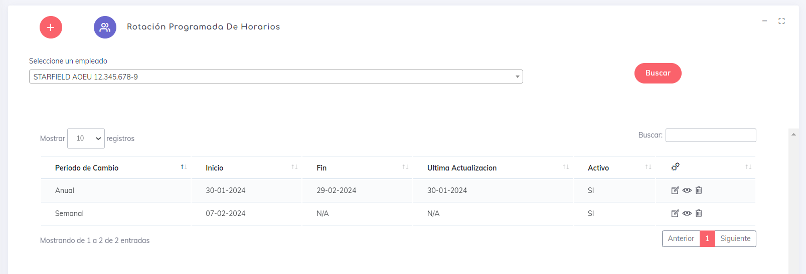

# Rotacion Programada De Horarios

En este apartado podremos asignar una rotacion de horarios  para la creacion  de horarios de manera automatica segun sea  requerido y en un orden especifico.

en la parte superior podremos ver nuestro boton de [crear](./rp/Created.md). 

Luego podremos ver un pequeno selector  que  contienen los empleados. esto para generar un filtro y que la administracion de estos elementos sea pan comido.

una ves seleccionado un usuario podremos ver si tiene alguna rotacion creada y en caso de ser asi tendremos algunas opciones.

la primera opcion es  [editar](./rp/Edit.md) la cual nos permite hacer ajustes a una rotacion ya creada. 

    Tener en cuenta que cuando el sistema  genera los nuevos horarios lo  hace en fechas que van a partir de la actual. no lo hace nunca en una fecha del pasado.
    
Luego esta la opcion de ver [detalles](./rp/Details.md) la cual  nos muestra un resumen de todos los elmentos que componen una rotacion.

y por ultimo la  opcion de eliminar o [desactivar](./rp/Delete.md), Tener en  cuenta que en esta seccion  del sistema realmente lo que hace  es desactivar esta  rotacion. la  eliminacion de estos elementos lo hace el sistema por si solo luego de que la  fecha  de vencimiento de la rotacion se encuentre vencida por lo menos  en 7 dias.

sobre el listado, podremos resaltar que los datos mostrados son el  periodo  de  cambio, fecha en que inicio estos cambios; fecha en que acaban o N/A   si no se selecciona dicha fecha; La ultima ves que se realiza una actualizacion y por ultimo tenemos si este elemento esta o no activo.