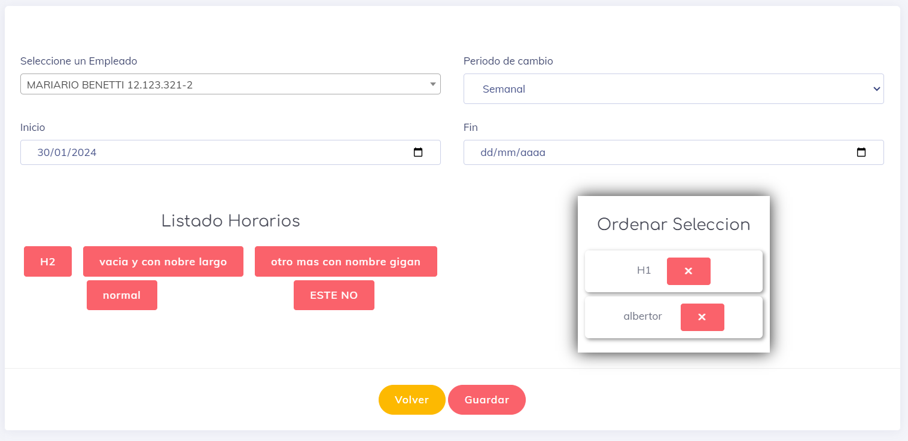

# Crear una Rotacion Programada de Horario

aca podremos crear una rotacion programada de horario en un periodo deseado. explicare  cada uno  de los campos a seleccionar segun lo que observamos en la imagen acontinuacion

* Primera seleccionamos  al **usuario** al cual se le aplicara dicha rotacion.
* luego tenemos el **periodo de cambio**. Por ahora trabajamos en semanal, Mensual y anual; Cada uno  tiene sus particularidades y estas las esplicaremos   luego.
* **Inicio** del periodo. este indica el dia en se asignara el primer horario y desde cuando se inicia dicha asignacion.
* **fin**, es cuando se dejara de asignar y se le impone el vencimiento a esta rotacion. Si no se escoje fecha alguna se mantendra la asignacion en un ciclo hasta desactivar esta rotacion o que el usuario quede inactivo para esta empresa.
* **seleccion de horarios**, en esta seccion podremas seleccionar y organizar los horarios a placer.

### Periodos de cambio

estos son los periodos que indican cada cuando se debe de reasignar un nuevo horarios y el sistema trabaja de manera distinta para cada uno.

* **Semanal:** se asigna un horario una ves a la  semana, el dia de asignacion es el   dia de semana en que inicia el periodo es decir la  fecha seleccionada en `Inicio`. por ejemplo  si un  periodo semana inicia el dia 1 de  febrero del 2024 el cual es un dia Jueves se asignaran horarios cada jueves hasta el siguiente miercoles durante el tiempo que dure dicha programacion.
* **Mensual:** Para  generar la  asignacion de manera mensual, este toma el dia asignado como dia de asignacion, usan el ejemplo del 1 febrero del 2024, quiere decir que se asignaran los 1 de cada mes para hacer con sigo el nuevo horarios.
* **Anual:** indica que se generara un  cambio anual. usando el mismo ejemplo  del 1 de febrero  del 2024  indica que el  proximo año se asignara un nuevo horario  el 1 febrero del 2025 y asi continuamente.

### Seleccion de Horarios

en esto  apartado hay que detenerse un poco para poder entender como funciona.

Como primer punto diremos que  podremos observar 2 columnas.

1. la  columna del lado izquierdo podremos ver el listado de horarios activos, disponibles y que no han sido seleccionados. Esta columna se le conoce como horarios.

    
    Para Seleccionar  un horarios  es tan simple como dar un click sobre el horario que se desea agregar.
    
2. la Columna del lado derecho es para ver la lista y organizar estos horarios en el orden que se seran asignados.

    
    Para quitar un horario de la lista, simplemente se da click en boton rojo.
    
    En el caso de organizar los horarios; simplemente se arrastra dicho horario hacia la  poscicion en la que se desea que sea asignado este horario.