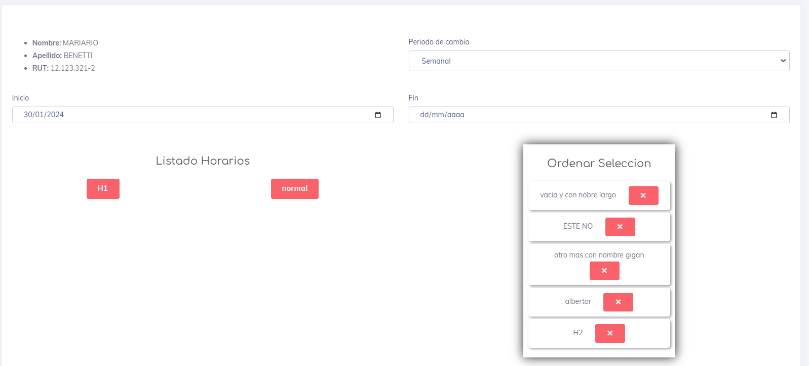

# Editar una Rotacion ya creada

Este apartado es bastante similar al de [Crear](./Created.md), con un par de cosas a tomar en cuenta

* el usuario no se puede modificar.
* las fecha corren a partir del   dia de la modificacion.
* todos los demas elemenos funcionan igual que en la creacion.

[Volver](../rp.md)