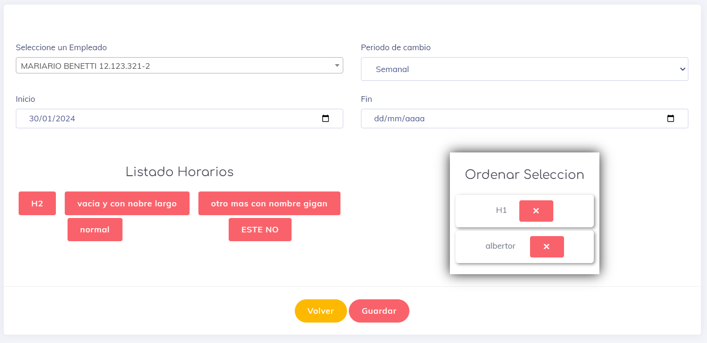

### Asignacion por grupos

Para la asignacion de grupos la vista es esactamete la  mismo que la asignacion normal, con la diferencia de que en ves de seleccionar un empleado se escoje el grupo en especial y ya la asignacion la realiza el software de manera automatica.

