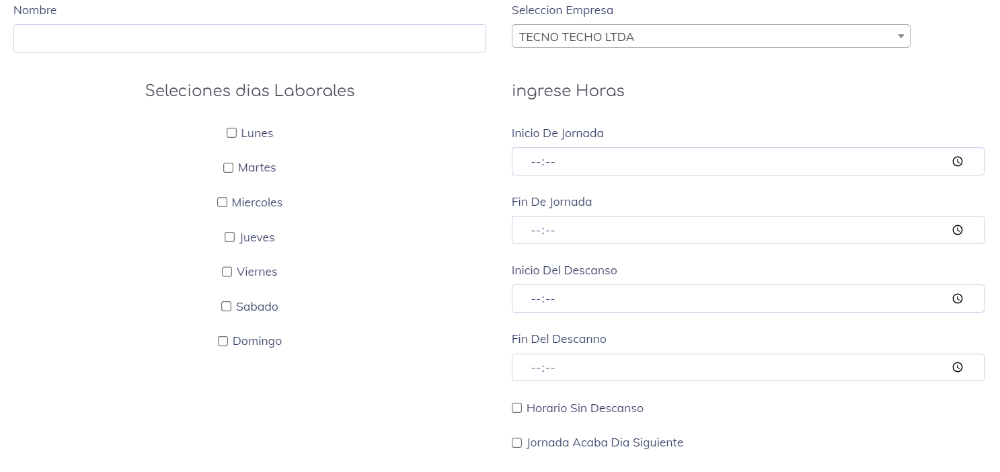
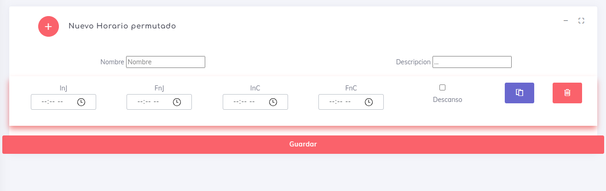

## Tipos De Horarios

para mayor facilidad en la creacion de horarios el sistema contiene 2 tipos de horarios llamados homogeneo y heterogeneo. Siendo el homogeneo aquel asignado con una sola jornada fija para la semana laboral, y el heterogeneo aquel que al menos un (1) dia es diferente al resto de la joranada.

### Horario Homogeneo

Un horario Homogeneo es aquel que se indica una misma jornada para toda la semana. una muestra del creador de horarios es la siguiente

 

De este modo podemos seleccionar los dias al que pertenece la jornada y configurar unas cuantas opciones. Este tipo de horario se creo con la intension de hacer simple el generar horarios para empresas que manejan este formato.

### Horario Heterogeneo

Un Horario Heterogeneo es aquel que nos permite editar la jornada semanal dia a dia.. dejando simplemente en blanco los dias no laborale y continuando con la elaboracion de horarios de manera detallada. Un ejemplo del creador de horarios es la siguiente.

#### Switch Horarrios

En caso de ser necesario en el menu principal existe una opcion para intercalar los horarios entre Homogenero y Heterogeneo; asi si luego de crear un horario se desea hacer un cambio por alguna circunstancia cual sea; simplementen con dar click en este boton se puede generar el cambio y desde aqui pasar a la edicion del horario. El boton mencionado se muestra en la siguiente imagen: 

Este boton se encuentra en una columna entre las opciones de los horarios en la vista principal de la pagina.

### Horario Minero

Este horario esta definido para aquellas personas donde su jornada tiene inicio y fin disponibles por periodos. Donde por ejemplo un trabajador trabaja durante 15 dias consecutivos y luego descansa 5, completando asi periodo de 20 dias pero que es un poco mas complejo al querer organizanlo destro del periodo normal de trabjo definido por semanas.

la idea de este horario es poder definir los periodos indicando que se hara cada dia, asi de esta manera el sistema asigna para cada dia el horario segun su periodo de asignacion y genera los reportes y marcas basados en este horario.

[volver](./index.md)