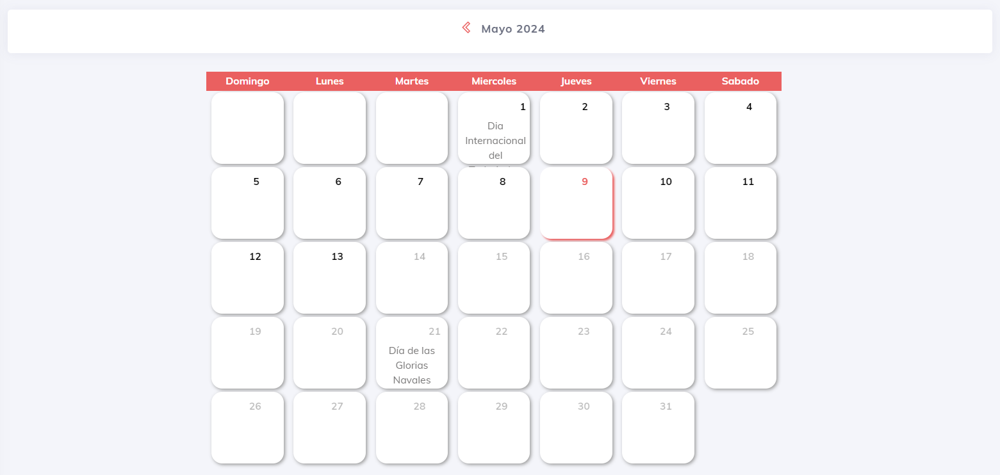
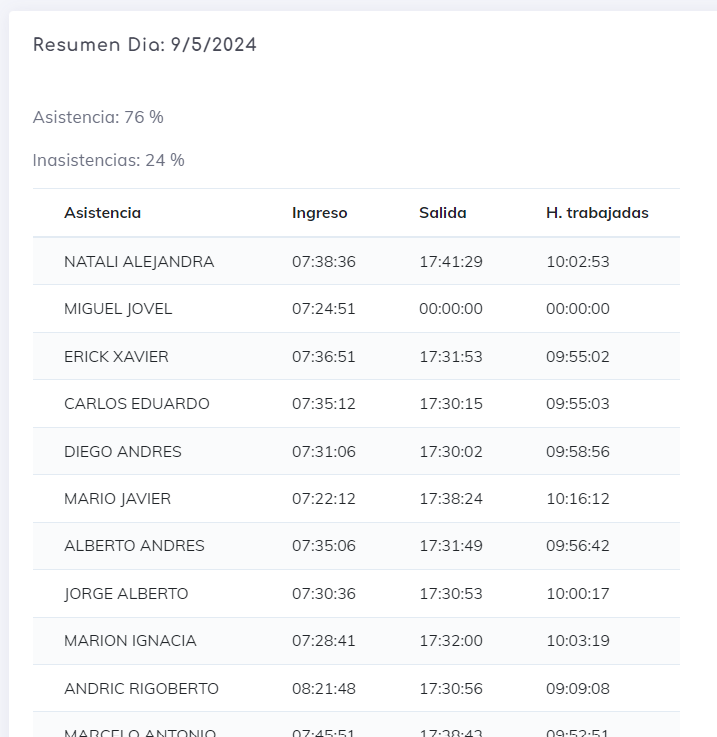
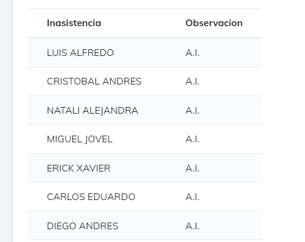
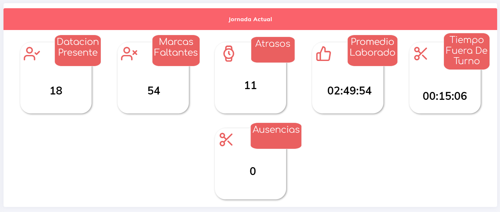
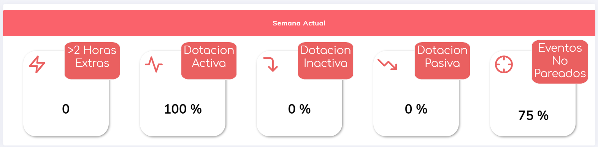

# Indicadores De Gestion

Estos elementos son un resumen donde se muestran los datos indicando porcentaje y resumenes de lo que esta ocurriendo en nuestra empresa.

en nuestra pantalla podremos observar los siguientes opciones

1. <b>Calendario:</b> indica asistencias he inasistencias de un dia seleccionado.
2. <b>Hoy:</b> Muestra los datos indicando la jornada que esta ocurriende en es momento actual y preciso.
3. <b>Semana:</b> Da resumen con los datos recaudados la semana actual.
4. <b>Mes:</b> en este se muestra todos los datos del mes actual.
5. <b>General:</b> obtenemos los datos a nivel general del holding y muestra los datos de las pantallas de periodos (hoy, semana y mes) en una misma pantalla.

## Calendario

en esta vista obtenemos un calendario, que nos indica los dias festivos y donde nos permite seleccionar un dia en especifico

una ves seleccionando podemos obtener la cantidad de horas trabajadas por un usuario y en caso de faltas, el tipo de falta que tiene este usuario.

## Hoy

Muestra los datos de la jornada actual, o de la jornada que transcurre en el dia verificado.

aca podremos observar los datos en pequeñas tarjetas donde se indican datos de manera general, y al dar click tendremos algo de informacion extra. Los datos obtenidos son los siguientes:

* __Datacion Persente:__ muestra los datos de los empleados presentes en la jornada actual.
* __Marcas Faltantes:__ Indica las marcas que faltan por generarse en la jornada actual.
* __Atrasos:__ atrasos en jornada actual.
* __Promedio Laborado:__ promedio laborado en la jornada actual.
* __Tiempo Fuera de turno:__ tiempo laborado en periodos fuera del turno pactado (antes de jornada, fuera de jornada, en periodo de colacion).
* __Ausencias:__ muestra las faltas a laborar en el dia de hoy.

## Semana

