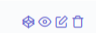
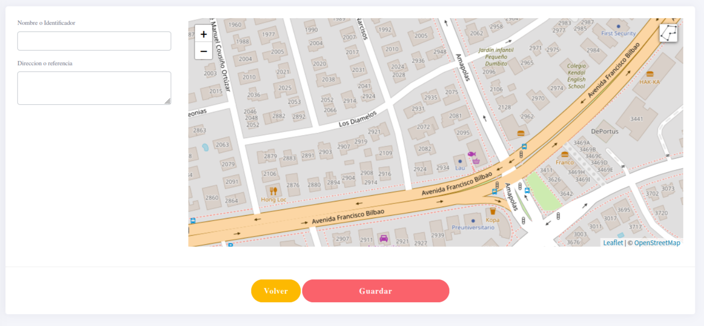
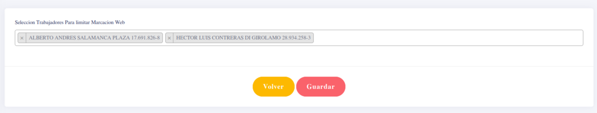

## GeoMarcas

al ingresar podremos ver una lista similar a la siguiente

con estas opciones

si se desea agregar se llena el formulario, asignando un espacio que se busca de manera manual

volviendo a las opciones, si se toma la primera es para asignar los usuarios que tienen que estaran asignandos a esta seccion:

La segunda opcion es para ver los detalles, la tercera para editar y la ultima elimina este espacio y todas sus asignaciones.
