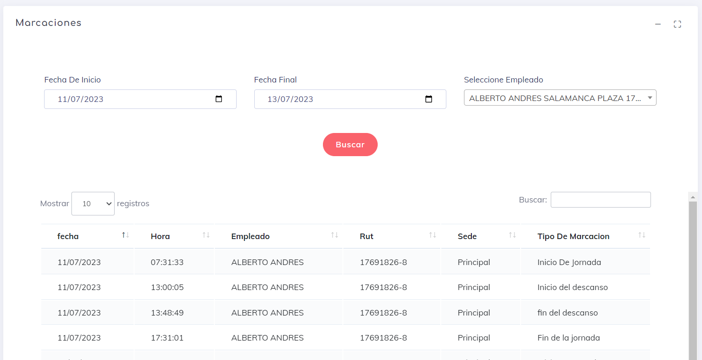

Una vez que ingresamos aquí, vemos la siguiente pantalla:

Aquí podemos ver varias acciones:

 para ocultar la pantalla actual.

 para maximizar la pantalla y trabajar con la vista actual.

Luego, en la parte inferior, tenemos una selección de fechas o período, y en el lado derecho, un selector de empleados. Esto nos permite utilizar nuestro rango de búsqueda y generar un estudio específico de cada marca.

Por último, tenemos el listado de marcas, donde se muestra la siguiente información de cada marca:

* **Fecha:** La fecha en la que se generó la marca.
* **Hora:** La hora exacta en la que se generó la marca.
* **Empleado:** El primer nombre y apellido del empleado observado.
* **RUT:** El RUT del empleado estudiado.
* **Sede:** El lugar donde se generó la marca.
* **Tipo de Marca:** Indica el tipo de marca que se generó.

---

[Volver](./Marcaciones.md)
