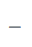
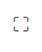

## Cambios

Al ingresar, encontramos una pantalla como la que se muestra a continuación:

Para [crear](../MarcaCrearCambio.md) un nuevo cambio, presionamos el botón .

También observamos que tenemos las siguientes acciones:

 para ocultar la pantalla actual.
 para ampliar la pantalla actual.

Luego, tenemos una tabla donde se muestra la siguiente información:

* **Fecha:** Fecha para la cual aplica este cambio.
* **Hora:** Hora que se está imponiendo.
* **Marca:** Tipo de marca.
* **RUT:** Identificador del afectado.
* **Nombre:** Nombre del afectado.
* **Razón:** Motivo por el cual se generó la marca.
* **Aceptado:** Indica si ambas partes están de acuerdo con este cambio.
*  para eliminar este cambio.

Hay algunos aspectos a tener en cuenta, ya que la normativa exige cierto comportamiento para generar este tipo de cambios. Los enumeraré a continuación y recalco que es de vital importancia tenerlos en cuenta:

1. Una vez generada la marca, se envía un correo al afectado indicándole dicho cambio.
2. La marca queda aceptada automáticamente y el afectado tiene un máximo de 24 horas para rechazar esta medida.
3. En caso de que el cambio sea rechazado, el proceso de generar nuevamente el cambio se puede repetir hasta un máximo de 3 veces. Después de eso, el empleado puede generar un reclamo formal con respecto a este cambio en la DT.

---

[Volver](./Marcaciones.md)
