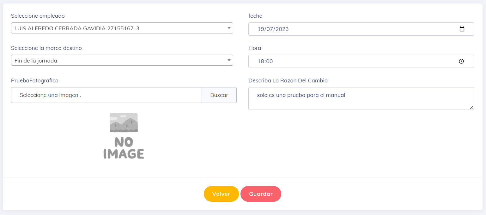

# Crear Cambio

una ves se ingresa a esta funcionalidad obtenemos la siguiente vista

ire explicando los datos que se agregan en orden

* _Empleado_ se selecciona el empleado al cual se le va a genera la marca.
* _fecha_ se asigna la fecha a la cual se va a modificar la marca.
* _tipo de marca_ se indica que marca objetivo es la que se desea sustituir.
* _hora_ se indica la nueva hora que se quiere modificar.
* _prueba Fotografica_ realmente es opcional, y es por si se quiere dejar constancia del por que se realiza este cambio.
* _razon_ una breve descripcion del por que se ejecuta esta accion.

valgo destacar que una ves generado el cambio el empleado recibe un correo electronico y tiene un maximo de 24 horas para rechasar dicho cambio.

---
[volver](./MarcaCambios.md)