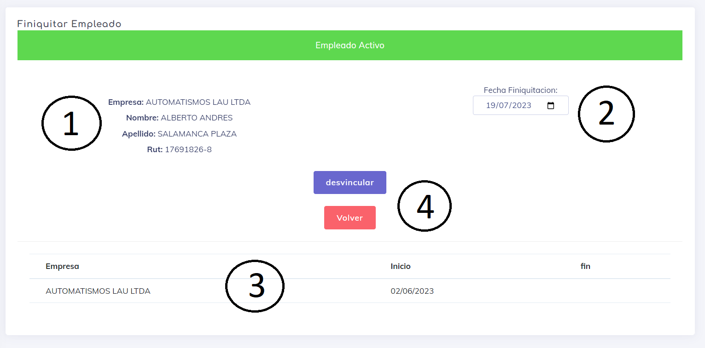

# Finiquitar / Desvincular

Esta opción se utiliza para finalizar la actividad de un trabajador en nuestra empresa. Una vez que se cumplen las condiciones de desvinculación, el empleado pierde la capacidad de realizar cualquier tipo de marcación relacionada con la empresa. Para la empresa, este empleado pasa a formar parte de los usuarios desvinculados, y en la sección de búsqueda de reportes se explica cómo obtener información sobre ellos.

Al ingresar a la vista de "Finiquitar", encontramos los siguientes elementos:

1. Datos del empleado y de la empresa a la que pertenece.
2. Condiciones a cumplir para la desvinculación: Básicamente, se selecciona una fecha para la cual se tiene prevista la desvinculación del empleado.
3. Historial de vinculaciones: Muestra un registro de las últimas vinculaciones del usuario en el sistema Asispass.
4. Botones de acción.

---

[Volver](./index.md)
