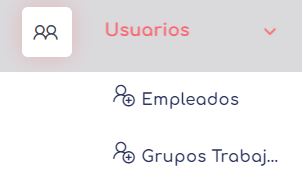
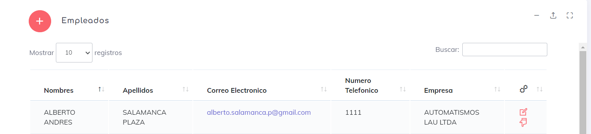
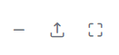
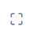
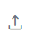
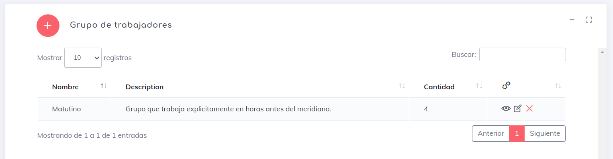
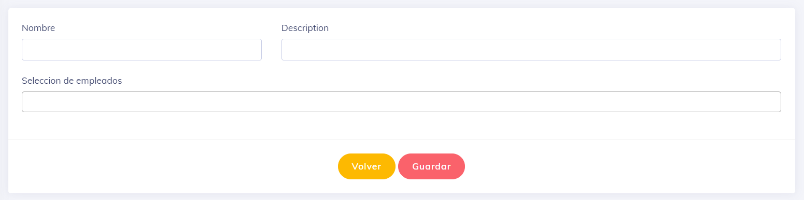
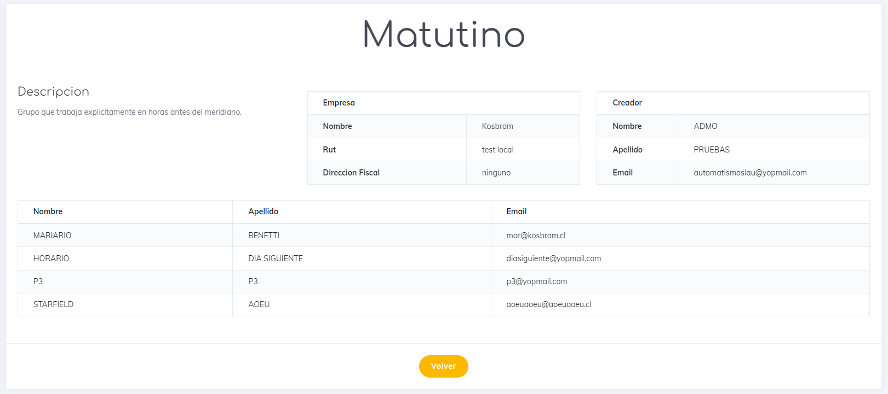

 
# Usuarios

aca tenemos 2 opciones a simple  vista; la opcion de **Empleados**  nos permite trabajar con este tipo de usuario y la opcion **Grupos Trabajadores** nos permite crear grupos de usuarios trabajadores para ser usados en otros elementos de la aplicacion.

## Usuarios

En esta sección, nuestro objetivo principal es trabajar con los empleados de las empresas.

Una vez que ingresamos al sistema, encontramos varios elementos a tener en cuenta.

En primer lugar, a simple vista, tenemos un listado de los empleados que pertenecen a la empresa activa actual.

Para [crear](./usc.md) un nuevo usuario, podemos hacer clic en el siguiente botón: 

Para [editar](./usu.md) un usuario existente, podemos hacer clic en el siguiente botón: 

También tenemos la opción de limitar la cantidad de elementos que se muestran por pantalla e incluso filtrar los elementos por cualquiera de los atributos mostrados en la tabla.

Es importante destacar que no existe el botón de eliminar, ya que los usuarios no se eliminan del sistema. En cambio, se utiliza la opción de [desvincular](./finiquitar.md)  para desvincular al usuario de la empresa, lo que lo marca como usuario inactivo en el sistema.

Además, podemos resaltar la siguiente zona de botones ubicados en la parte superior derecha de la tabla: 

: Sirve para minimizar la tabla y ocultarla.

: Sirve para maximizar la tabla y ocupar toda la pantalla.

: Permite generar la [carga masiva de usuarios](./CargaMasivaUsuarios.md) dentro del sistema.

---

## Grupo de Trabajadores

Al entrar en esta pantalla podremos encontrar una pantalla similar a la siguiente imagen

vale aclarar que esta opcion es valida esclusivamente para usuarios Admo de empresas.

aca podremo ver  una lista  de los grupos que se crearon anteriormente, donde se encuentran listado por nombre, Descripcion de este grupo y la  cantidad de trabajadores que participan en cada grupo.

*  podemos **crear** un nuevo usuario con la opcion 

    Para crear un elemento simplemente agregamos un nombre, se agrega  una descripcion y al final se eligen  los  usuarios

* Editar un elemento con la siguiente opcion 

    editar no es gran  cosa, pues es tan  simple como crear. 

* Eliminar un grupo existente con el siguiente boton 

    simplemente eliminar un elemento lo saca literalmente de este y cualquier contexto.

* y para ver detalles de este elemento usamos el siguiente boton 

    Los detalles son simplemente donde podemos ver  todos los datos que contiene este elemento en si.
    

    
En los lugares donde esta funcionalidad esta disponible, se puede conseguir

lo podemos conseguir en este momento en los siguiente elementos:

* Asignacion de Horarios.
* Asignacion de Rotacion de horarios por periodo.
* Asignacion de Permiso y vacasiones.

___

[Volver](../1.AdmoEmpresas.MD)
