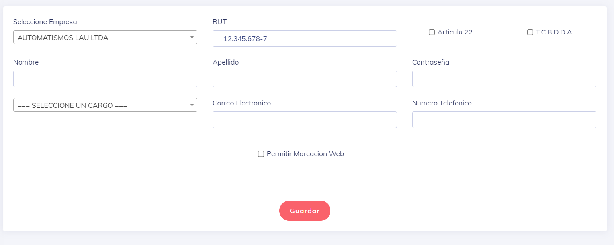

# Editar Empleado

Una vez que ingresamos a la pantalla, obtenemos una vista similar a la siguiente:

La única diferencia es que en esta pantalla se mostrarán los datos del usuario en cuestión. Aquí podemos editar cualquier campo del empleado o activar otros elementos, como la marcación web.

A continuación, explicaré un poco sobre los campos que podemos editar y/o modificar:

* Seleccione Empresa: Aquí seleccionamos la empresa a la que pertenece el usuario. También podemos cambiarlo si deseamos que el empleado aparezca como parte de la plantilla de una empresa diferente a la original. Es importante destacar que toda la documentación se actualizará específicamente para apuntar a esta nueva empresa.

* RUT: Este campo ya debería estar lleno, pero en caso de estar equivocado, se puede modificar. Es importante tener en cuenta que el RUT es único para cada usuario y solo puede existir un registro en el sistema para cada usuario.

* Artículo 22: Permite seleccionar si el usuario pertenece o no al Artículo 22. Básicamente, en nuestro sistema, esto permite que estos usuarios realicen marcas incluso por encima de las restricciones anteriores.

* T.C.B.D.D.A o Trabajadores del Comercio Beneficiarios de Descansos Dominicales Adicionales: Sirve para indicar si este empleado pertenece a este tipo de trabajos.

* Nombre: Se utiliza para indicar el nombre o nombres del trabajador en cuestión.

* Apellido: Se utiliza para indicar el o los apellidos del trabajador en cuestión.

* Contraseña: Se indica la contraseña de acceso original del usuario. Esta contraseña también le llegará al empleado por correo y él podrá cambiarla según su preferencia.

* Seleccione el cargo: Se toma la lista de cargos en la empresa basados en la empresa seleccionada, y es una exigencia de la DT.

* Correo Electrónico: Es de vital importancia, ya que es uno de los modos de ingreso al sistema.

* Número Telefónico: Se utiliza para mantener en la base de datos de la empresa.

* Permitir Marcación Web: Se utiliza para indicar si este trabajador puede hacer marcaciones desde una ubicación distinta a donde están ubicados nuestros relojes de marcación.

---
[volver](./index.md)
