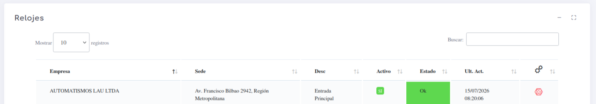
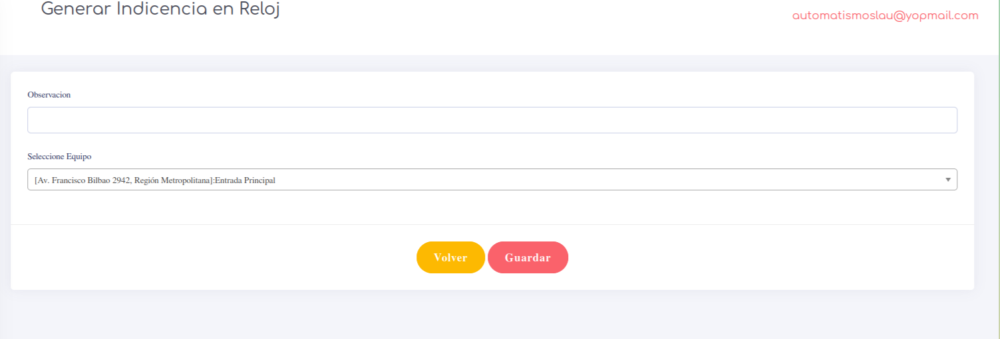

# Relojes

En esta vista podremos observar los relojes que se tienen instalados en sus sistema y nos entrega informacion sencilla sobre ellos.

Tambien tenemos una opcion, la cual nos permite generar una incidencia de manera directa

