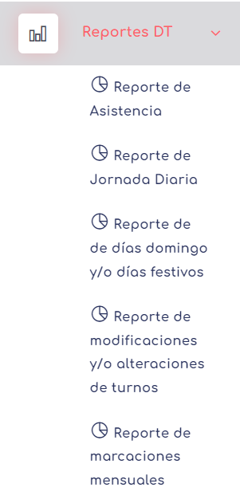
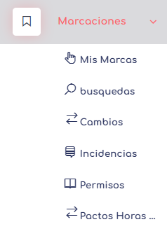

    > Glosario
    [C] Sinifica que es un atributo commun para cualquier tipo de usuario

# Empleados:

en esta secccion del manual se explican uno a uno los elementos, habilidades y atributos de los usuarios a de nivel empleado.

* [Login](../0.TodosLosUsuarios/Login.MD) [C]
* [Layout](../0.TodosLosUsuarios//Layout.MD) [C]
* [Reportes](../0.TodosLosUsuarios/./Reportes/Reportes.MD) [C]

    
* [Horarios:](./Horarios.md) Permite definir y configurar los horarios de trabajo para los empleados de la empresa.

* [Marcaciones:](./Marcaciones/index.md) Permite realizar el registro y seguimiento de las marcas de los empleados, generar cambios en alguna marcacion, generar permisos, crear pactos de horas extras... 

 
--
* [Feriados](./Feriados.MD) [C]

* [Validadores](./Validadores.md)   [C] 

* [Mi Cuenta](./MiCuenta.md) 

--

 [volver](./../README.md)